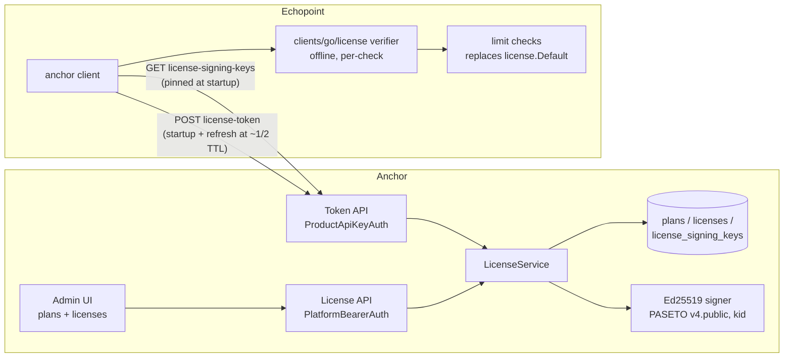

# License & Entitlement System

Status: implemented (v1) — this document is the design record for the `feat/license-entitlements` PR.

## Why

Echopoint today hardcodes a deployment-wide `license.Default()` struct
(`echopoint/internal/domain/license/license.go`): four numeric limits shared by every tenant, with a
comment promising "a future licensing system". That future system belongs in Anchor: licensing is an
org-level concern (who is this customer, what did they pay for), and Anchor already owns tenancy,
identity and RBAC. Plans and subscriptions (Stripe) come later; this v1 builds the substrate they
plug into.

## Architecture

**Anchor owns three things: mutable entitlement state, an Ed25519 signing service, and a token
issuance API. Consumer services own one thing: a verifier.** The signed token is a *derived,
disposable artifact* of the mutable license row — never the license itself (the mistake Keygen's
docs warn about with immutable signed keys: plans change, so sign short-lived snapshots instead).

- **Hot path is offline.** Echopoint verifies the cached token locally (Ed25519, sub-microsecond).
  Anchor being down must never take a consumer down — network contact happens only at
  issuance/refresh (the LicenseSpring/Cryptlex split: local checks always, periodic online sync).
- **Revocation = refusing the next refresh.** Short TTL (24 h default) + renewal beats revocation
  lists; worst-case revocation latency equals the TTL. No CRL plumbing in v1.
- **Two grace windows, both server-set.** *Sync grace*: consumer keeps honoring the cached token for
  a bounded window after `exp` when Anchor is unreachable — degrade, never crash. *Business grace*:
  license past `expires_at` but inside `grace_until` still gets tokens, with `status=GRACE`, so the
  UX can show "renew" instead of hard-cutting at the expiry instant.

## Data model (new migration)

| Table | Purpose |
|---|---|
| `plans` | Per-product plan: `key` (stable string, future Stripe `lookup_key`), name, description, `entitlements` JSONB, `is_default` |
| `licenses` | One per organization: `plan_id`, `status` (`ACTIVE\|SUSPENDED\|REVOKED`), `expires_at`, `grace_until`, `entitlement_overrides` JSONB, `token_ttl_seconds` |
| `license_signing_keys` | Ed25519 keypairs: `kid` (KSUID `lsk_…`), public key, private key encrypted with the framework `VersionedCipher`, `status` (`ACTIVE\|RETIRING\|RETIRED`) |

Entitlements are a JSONB map `key → {type: boolean|numeric, value}` rather than normalized
`plan_entitlements` rows: v1 has no per-entitlement queries, the service layer validates shape (per
anchor's "business rules live in the service, DB keeps constraints minimal" rule), and the admin UI
edits the whole map at once. Revisit if per-feature analytics or metered usage arrive.

**Resolution chain: plan defaults → per-org overrides.** Overrides attach to the license row
(Schematic's guidance: enterprise custom terms must not branch product code). Consumers ask
"does org X have feature Y / what is limit Z" — never "is this org on Pro"; plan names in consumer
code is the interpretation-drift failure mode (Stigg).

Three entitlement kinds exist in the taxonomy (boolean, numeric, metered — Stigg/OpenMeter
consensus). v1 implements boolean + numeric; **metered is deliberately out**: a signed snapshot can
carry a quota ceiling but not live usage. When metering arrives, the token carries the limit and
usage lives server-side.

## Token

**Format: PASETO v4.public** (`aidanwoods.dev/go-paseto`). All research converged on Ed25519-signed
claim snapshots; PASETO removes the JWT failure modes we'd otherwise have to configure away
(`alg=none`, RS256→HS256 key confusion) because v4.public *is* Ed25519 with no algorithm
negotiation. `kid` travels in the footer so verifiers select a key before signature check.

Claims: `organization_id`, `product_id`, `plan_key` (informational), `status`
(`ACTIVE|GRACE|SUSPENDED`), `entitlements` (resolved map), `iat`, `exp`, `grace_until`,
`refresh_after`, `schema_version`. No Stripe IDs, ever — tokens carry derived entitlements only.

**Key rotation is designed in from day one even with one key** (retrofitting `kid` into deployed
verifiers is far worse than carrying it unused): every token names its `kid`; verifiers hold an
ordered set of trusted public keys fetched from `GET …/license-signing-keys` at startup; rotation =
add new ACTIVE key → old key RETIRING (still verifies, no longer signs) → RETIRED only after
max-TTL + buffer (Curity/WorkOS overlap-window rule). Private keys never leave Anchor and are
stored encrypted with the same `VersionedCipher` pattern as integration secrets.

## API surface (contract-first, `cmd/http/openapi.yaml`)

Platform admin (`PlatformBearerAuth`) — drives the admin UI:

- `POST/GET /v1/products/{product_id}/plans`, `GET/PATCH/DELETE /v1/products/{product_id}/plans/{plan_id}`
- `GET /v1/products/{product_id}/licenses` — list with org + status
- `GET/PUT /v1/products/{product_id}/organizations/{organization_id}/license` — assign/update (plan, expiry, grace, overrides)
- `POST …/license/revoke`, `POST …/license/suspend`, `POST …/license/reinstate`

Service-to-service (`ProductApiKeyAuth`) — consumed by echopoint via the generated Go client:

- `POST /v1/products/{product_id}/organizations/{organization_id}/license-token` → `{token, refresh_after, expires_at}`
- `GET /v1/products/{product_id}/license-signing-keys` → `[{kid, public_key, status}]`

Validation results are **typed statuses, not booleans** (Keygen's `VALID/EXPIRED/SUSPENDED/…`
model): "expired — show renew banner" and "suspended — hard block" are different UX.

## Verifier (`clients/go/license`)

Hand-written package next to the generated client: `NewVerifier(keys)`, `Verify(token) → (Claims,
Status)`, `Claims.HasFeature(key)`, `Claims.Limit(key)`. Enforces PASETO v4.public only, makes
unverified claims unreachable (parse-before-verify is the classic licensing exploit), and returns
`GRACE` for tokens past `exp` but inside `grace_until`. One canonical verifier — no consumer
hand-rolls parsing.

## Echopoint migration plan (follow-up PR in echopoint)

1. Regenerate `clients/go` (`make generate-client`) — echopoint's existing anchor client gains the
   license endpoints for free.
2. Echopoint startup: fetch signing keys + license token for its org scope, cache, background-refresh
   at `refresh_after` (durable retry, not bare goroutine).
3. Map claims onto the existing `license.License` struct — the static struct becomes the *shape* of
   a verified snapshot. Suggested keys: `executions.max_cloud_duration_seconds`,
   `flow_schedules.max_flows_per_run`, `flow_schedules.min_interval_minutes`,
   `flow_schedules.max_schedules_per_org`.
4. Fallback: anchor unreachable beyond sync grace → keep last verified token; no token ever →
   `license.Default()` (fail-open to today's behavior, never crash).
5. Later: per-org tokens replace the global singleton where limits are org-scoped.

## Stripe / subscription readiness (future, no code in v1)

Plans are internal; Stripe is an input, never the decision point. When billing arrives: one Stripe
customer per org created before checkout; webhook handlers only verify signature, dedupe on event
ID, and enqueue a durable `ReconcileBillingCustomer` job (pgqueue) that refetches full subscription
state and upserts the license row — never act on event payload deltas (t3dotgg/Stripe guidance;
the entitlement-summary event even caps at 10 items). Status mapping: `trialing/active → ACTIVE`,
`past_due → GRACE` (Stripe Smart Retries is the dunning system — don't rebuild timers),
`unpaid/canceled → REVOKED`. `plans.key` is the future Stripe `lookup_key`. Because tokens are
short-lived derived artifacts, Stripe integration will not touch consumers at all.

## Deliberate non-goals (v1)

- Machine fingerprinting / node-locking / heartbeats — desktop-vendor machinery; consumers are
  trusted internal services in containers (renewal is the liveness signal). If self-hosted installs
  arrive, add an instance-id claim (Grafana binds to `root_url`).
- Metered entitlements (see above), CRL/kill-switch sets, air-gapped long-lived license files.
- Audit-log integration — lands with the audit-log branch (PR #44), not merged at time of writing.
- Anchor gating *itself*: an identity platform must never brick a tenant's admins over license
  state; auth and RBAC survive any license status.

## Sources

Research run: 6 themed agents, 41 page-reads, deduplicated below.

### Signed tokens & formats
1. [Keygen — Cryptography API](https://keygen.sh/docs/api/cryptography/) — Ed25519 recommended over RSA; signed keys are immutable, so issue re-checkout-able TTL'd license files verified against a public key pinned in the client.
2. [Keygen — Offline licensing model](https://keygen.sh/docs/choosing-a-licensing-model/offline-licenses/) — embed grace periods and issued/expiry snapshots in the signed payload; TTL'd checkout files beat baked-in expiry for renewable licenses.
3. [Keygen — Validating license keys](https://keygen.sh/docs/validating-licenses/) — machine-readable validation codes (VALID/EXPIRED/SUSPENDED…); on network failure fall back to cached cryptographically-verified license + grace period.
4. [TECH SCHOOL — Why PASETO beats JWT](https://dev.to/techschoolguru/why-paseto-is-better-than-jwt-for-token-based-authentication-1b0c) — JWT's alg-in-header enables `none`/key-confusion attacks; PASETO removes algorithm agility (v4.public = exactly Ed25519).
5. [paseto.io](https://paseto.io/) — v4.public has a spec, test vectors, and maintained Go implementations (go-paseto).
6. [Keyforge — Offline license validation with JWT](https://keyforge.dev/blog/offline-license-validation) — signed token + local verify + background refresh; short expiry is the only offline revocation, so pair with grace.
7. [10Duke — Handle and store JWT license tokens](https://docs.enterprise.10duke.com/developer-guide/consuming-licenses/handle-and-store-jwts/) — JWKS-published verification keys; re-verify signature on every read from storage.

### License server architecture
8. [Keygen — Licenses API](https://keygen.sh/docs/api/licenses/) — validation as a first-class endpoint with granular codes and lifecycle actions (suspend/reinstate/renew/revoke).
9. [Keygen — Machines API](https://keygen.sh/docs/api/machines/) — heartbeat state machine + zombie culler for floating seats (deliberately skipped in v1).
10. [LicenseSpring — License check best practices](https://docs.licensespring.com/sdks/tutorials/best-practices/license-checks) — local checks every startup, online sync every few days; 48 h grace starting at first failed request, reset on success.
11. [Cryptlex — License templates](https://cryptlex.com/docs/license-management/license-templates) — server-side policy knobs: sync interval floors to protect the API, sync grace, lease duration, allowed clock offset.

### Entitlements & plan modeling
12. [Stripe — Entitlements docs](https://docs.stripe.com/billing/entitlements) — Features with stable `lookup_key`s attached to Products; Stripe itself recommends persisting entitlements internally.
13. [Stripe dev blog — SaaS access control with Entitlements API](https://stripe.dev/blog/managing-saas-access-control-with-stripe-entitlements-api) — the model is purely binary (no metering); auto-created active_entitlements per customer.
14. [Stigg — Entitlements untangled](https://www.stigg.io/blog-posts/entitlements-untangled-the-modern-way-to-software-monetization) — three entitlement kinds (boolean/numeric/metered), keyed by feature not plan name, one centralized check module.
15. [Schematic — Entitlement management system guide](https://schematichq.com/blog/entitlement-management-system) — entitlements ≠ roles; account-specific overrides attach to the account record; checks are hot-path.
16. [AWS APN — SaaS entitlements with LaunchDarkly](https://aws.amazon.com/blogs/apn/simple-and-flexible-saas-entitlement-management-with-launchdarkly/) — tier-segment targeting with per-tenant exceptions; boolean flags gate, multivariate flags carry limits.
17. [Lago — Feature entitlements](https://getlago.com/blog/feature-entitlements) — subjects × resources × conditions model with temporal boundaries and billing-synced counters.

### Billing / subscription integration
18. [Stripe — Webhooks with subscriptions](https://docs.stripe.com/billing/subscriptions/webhooks) — events are async and unordered; dedupe on event ID; periodic API reconcile as fallback.
19. [t3dotgg/stripe-recommendations](https://github.com/t3dotgg/stripe-recommendations) — ignore event payloads; one `syncStripeDataToKV(customerId)` refetches full state from both webhook and success redirect; pre-create the customer.
20. [Stripe — How subscriptions work](https://docs.stripe.com/billing/subscriptions/overview) — the eight statuses and exactly which provision access (`trialing/active` yes, `past_due` during retries, `unpaid/canceled` no).
21. [Stripe — Subscription quantities](https://docs.stripe.com/billing/subscriptions/quantities) — seats = item quantity; mid-cycle updates auto-prorate.
22. [Stripe — Prorations](https://docs.stripe.com/billing/subscriptions/prorations) — `proration_behavior` + pinned `proration_date` previews for showing exact deltas before a plan change.
23. [Stripe — Smart Retries](https://docs.stripe.com/billing/revenue-recovery/smart-retries) — Stripe retries ~8× over a configurable window; align app-side grace with that window instead of rebuilding dunning timers.

### Key management & binding
24. [Keygen — Security guidance](https://keygen.sh/docs/api/security/) — all client-side enforcement is crackable; the only trustable component is the signed server API; obfuscation is not a boundary.
25. [Keygen — Node-locked licensing](https://keygen.sh/docs/choosing-a-licensing-model/node-locked-licenses/) — fingerprint-scoped validation and its UX; irrelevant for trusted internal services (why v1 binds to org, not machine).
26. [Keygen — Floating licensing](https://keygen.sh/docs/choosing-a-licensing-model/floating-licenses/) — first-come activations + heartbeat-culled zombies; VMs need random-UUID fingerprints.
27. [WorkOS — Developer's guide to JWKS](https://workos.com/blog/developers-guide-jwks) — pre-publish new key, wait a full cache cycle, then switch; unique kids across history; overlap = TTL + cache TTL + buffer.
28. [Curity — Token signing key rotation](https://curity.io/resources/learn/token-signing-key-rotation/) — serve old + new public keys keyed by kid; remove old only after every token it signed expired.
29. [LicenseSeat — Air-gapped licensing](https://licenseseat.com/docs/guides-air-gapped-licensing/) — sneakernet flow with 30-day-to-10-year TTLs trading convenience vs revocation latency (future self-hosted tier reference).

### Real-world implementations
30. [GitLab — Activate EE](https://docs.gitlab.com/administration/license/) — activation code with offline file fallback; expiry locks *some* functionality, never the whole instance.
31. [GitLab — Cloud licensing FAQ](https://about.gitlab.com/pricing/licensing-faq/cloud-licensing/) — daily minimal-field sync enables quarterly seat-overage reconciliation; approval-gated offline licenses for air-gapped.
32. [Unleash — License keys](https://docs.getunleash.io/deploy/license-keys) — seat count + duration in the key; degrades to read-only on expiry (SDK delivery keeps working); warns at <10% seats and <30 days.
33. [Grafana — Enterprise licensing](https://grafana.com/docs/grafana/latest/administration/enterprise-licensing/) — license is a JWT bound to `root_url`, auto-refreshed every 24 h; staggered feature degradation on expiry (the model for our per-feature grace).
34. [Tailscale — Pricing FAQ](https://tailscale.com/pricing/faq) — seats counted on first authentication; auto-increment with prorated billing past the cap; features gated by quantity tiers.
35. [OpenMeter — Entitlements overview](https://openmeter.io/docs/billing/entitlements/overview) — metered/static/boolean entitlement types layered on Features, one check API instead of plan names.
