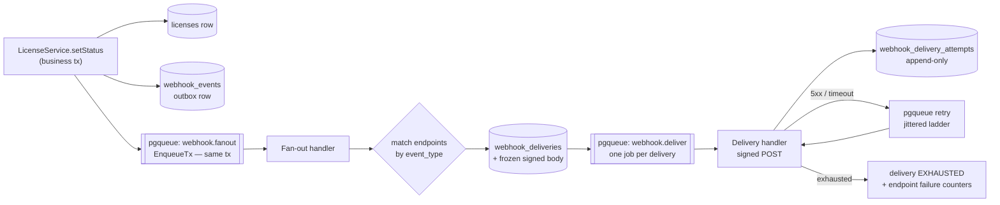

# Outbound Webhooks

Status: implemented (v1) — design record for the webhook half of the `feat/license-entitlements` PR.

## Why

Anchor holds state that consuming products need to react to: today a license changing status, tomorrow
organization and membership changes. Consumers currently poll `GET …/entitlements` on a refresh
interval, so a revoke takes up to one interval to land. A webhook makes that immediate.

The system is **generic from the first commit**. `license.*` is the first event group, not the design
target: adding an event type later means emitting it, never touching delivery, signing, or retry.

## Architecture

**Transactional outbox on top of `pgkit/pgqueue`.** The event row and its job are written in the same
database transaction as the business change, so an event is emitted if and only if the change
commits. No HTTP call ever happens inside a transaction — an HTTP call cannot be rolled back, and
holding a connection across a 15-second POST exhausts the pool.



Two queues, deliberately separate. Fan-out is fast and touches only the database; delivery is slow
and touches the network. One queue for both would let a single unreachable endpoint delay every
other product's events behind it.

**pgqueue does the hard parts.** Claim-with-lease, visibility timeout, stuck-job reaping, retry
scheduling and attempt counting already exist and are already proven by the inbound Clerk worker
(`internal/service/integration_event_worker.go`). This feature supplies a `RetryDelayFunc` for the
ladder below and returns `pgqueue.NonRetryable` for permanent failures. It does not reimplement a
queue.

## Data model (migration `000024`)

| Table | Prefix | Purpose |
|---|---|---|
| `webhook_endpoints` | `whe_` | Product-scoped subscription: URL, subscribed event types, status, failure counters |
| `webhook_endpoint_secrets` | `whs_` | Signing secrets, encrypted at rest; two rows co-exist during rotation |
| `webhook_events` | `evt_` | The outbox row: type, payload, product/org scope |
| `webhook_deliveries` | `whd_` | One row per (event × endpoint) with the exact bytes to send |
| `webhook_delivery_attempts` | `wha_` | Append-only attempt log: status code, error, duration |

`webhook_deliveries` carries `UNIQUE (event_id, endpoint_id)` so a re-run of fan-out after a crash
cannot double-deliver, and stores `signed_body` frozen at fan-out time. **The body is never
re-marshalled at send time**: a deploy that changed JSON field ordering would otherwise invalidate
every in-flight signature.

Endpoint secrets are a table rather than a column because rotation needs two live secrets at once.

## Event envelope

```json
{
  "id": "evt_2gH…",
  "type": "license.updated",
  "api_version": "2026-07-23",
  "occurred_at": "2026-07-23T14:02:11Z",
  "test": false,
  "product_id": "prd_…",
  "organization_id": "org_…",
  "data": {
    "license_id": "lic_…",
    "plan_key": "pro",
    "status": "SUSPENDED",
    "changes": { "status": { "previous": "ACTIVE", "new": "SUSPENDED" } }
  }
}
```

**Thin with context, not fat.** The payload carries identifiers plus enough denormalized fields for
a receiver to decide whether it cares, then the receiver re-reads `GET …/entitlements` for truth.
Anchor is an identity system; pushing full entitlement maps into third-party logs is a liability,
and because delivery is unordered a copied snapshot can be wrong on arrival. The webhook is the
low-latency trigger; the existing poll becomes the reconciliation floor.

**v1 event types**: `license.created`, `license.updated`, `license.revoked`, `plan.updated`, `ping`.

Grammar is `<group>.<event>`, past tense, validated against `^[a-z0-9_]+(\.[a-z0-9_]+)+$`. Types live
in a registry (`internal/domain/webhook/registry.go`) mapping type → description → **sample payload**;
the OpenAPI enum, the admin UI's picker and the test-event sender all derive from it, so a new event
type is one registry entry plus an emit call.

`plan.updated` fires **once at product scope**, not once per licensed organization. Per-org
amplification on a plan edit is the easiest available way to self-inflict a delivery storm.

### `test` is always present, never omitted

`test` is `false` on every real event and `true` on anything sent from the admin UI's test surface. It
is not `omitempty`: a receiver must be able to *assert* `test === false` before acting, and an absent
field would make "this is not a test" and "this came from an older Anchor" indistinguishable. Neither
Svix nor Clerk marks example sends at all, so in both products a test event is indistinguishable from
a real one in the log — a cheap gap to close, and closing it is what lets a receiver log a test send
and refuse to act on it.

The marker is **derived, not stored**: `Event.IsTest()` is `TargetEndpointID != nil`. Targeting is
exact rather than merely convenient — an event addressed at a single endpoint can only have come from
the test-event sub-resource, because every business emit broadcasts to whoever subscribes. Should a
future feature ever need to target a real event at one endpoint, this derivation has to become a
stored column; the invariant is documented on the method so that change is forced rather than missed.

## Test events and the sample-payload seam

Every registry entry carries a `Sample`: a representative `data` object with illustrative identifiers.
It is published on `GET /v1/webhook-event-types` as `sample_payload` (indented JSON), previewed in the
admin UI before a send, and transmitted verbatim by a test send. `ping` is the one type whose sample
is rewritten at send time, because a ping names the endpoint it probes rather than a placeholder.

The sample is the seam, and it is enforced rather than encouraged: a table-driven unit test walks the
whole registry and fails on any type without a sample, or whose sample does not marshal to a non-empty
JSON object. Adding an event type therefore also gives it a working test send, a payload preview and a
catalog entry — or it does not merge.

`POST …/{webhook_endpoint_id}/test-event` takes an optional `{"event_type": "<registered type>"}`.
Omitted means `ping`, which is exactly what `POST …/ping` does — `/ping` is kept as the body-free
shorthand rather than being renamed, so scripts and monitors that just want a transport probe keep
working unchanged. An unregistered type, or a `<group>.*` wildcard, is rejected with
`INVALID_WEBHOOK_EVENT_TYPES` (400): a wildcard is a subscription, never a sendable event.

**The send answers with the delivery ids it created**, which is what lets the admin UI poll the
outcome of *that* send rather than guessing which row in the log belongs to it. Getting the id back
requires the delivery to exist before the response is written, so a test send runs fan-out inside its
own emitting transaction instead of waiting for the queued job. That costs nothing and removes a race:
the delivery row and the fan-out job become visible at the same commit, so the job finds the row
already there and skips it — the same idempotency that already protects a crash-recovery re-run.

## Signing: Standard Webhooks

Headers follow the [Standard Webhooks](https://www.standardwebhooks.com/) spec verbatim:

```
webhook-id: whd_2gH…                       (delivery id, stable across retries)
webhook-timestamp: 1753280531               (unix seconds, fresh per attempt)
webhook-signature: v1,<base64 HMAC-SHA256>  (space-delimited list during rotation)
```

Signed content is `{webhook-id}.{webhook-timestamp}.{body}`. Secrets are 32 random bytes, base64
-encoded and `whsec_`-prefixed exactly as the spec prescribes — a verifier strips `whsec_` and
base64-decodes the remainder to recover the HMAC key. Using the spec's own secret format (rather than
Anchor's internal `PrefixedSpec` API-key tokens, which are checksummed alphanumerics with nothing to
decode) is the whole point: an off-the-shelf Svix-compatible verifier works unmodified, which the
`internal/domain/webhook` unit tests prove against the published Standard Webhooks test vector.
Secrets are encrypted at rest with the framework `VersionedCipher` (context `webhook-signing-secret`)
and returned in plaintext exactly twice: at endpoint creation and at rotation.

**Why symmetric HMAC rather than asymmetric.** Asymmetric signing buys non-repudiation — with a
shared secret, a receiver could forge a message indistinguishable from Anchor's. That matters when a
receiver could profit by fabricating or denying an event, which is the billing-settlement case. A
forged `license.updated` gains a forger nothing they cannot already read from the API, so the
property is not worth the key-distribution cost. What *is* worth paying for is integration cost:
Standard Webhooks means every consumer verifies with an off-the-shelf library instead of reading our
documentation. The spec reserves `v1a,` and `whpk_` for ed25519, so adding opt-in asymmetric signing
per endpoint later is additive rather than breaking — that reservation is what makes this choice
safe rather than merely convenient.

Rotation: `POST …/rotate-secret` inserts a new ACTIVE secret and marks the previous one EXPIRING with
`expires_at = now() + 24h`. Both signatures ride in the space-delimited header until expiry, so a
receiver can roll over without coordination or downtime.

## Retry, auto-disable, dead letter

**Ladder: 8 attempts across roughly 21 hours** — `0s, 15s, 1m, 5m, 30m, 2h, 6h, 12h`, each multiplied
by full jitter in `[0.75, 1.25]`. Without jitter every product's endpoint retries in lockstep after
*our* deploy, turning one incident into a self-inflicted thundering herd.

**Classification** decides retry-or-not:

| Response | Outcome |
|---|---|
| 2xx | `SUCCEEDED` |
| 5xx, 408, 429, timeout, DNS, transient TLS | retry (honor `Retry-After` on 429, capped at 12h) |
| 4xx other than 408/429 | `FAILED` immediately — a 404 will still be a 404 in twelve hours |
| 410 Gone | disable the endpoint, per spec |

**Auto-disable requires two conditions**: 20 consecutive failures **and** a first failure older than
24 hours. Either alone is wrong — a ten-minute deploy blip can trivially produce twenty failures, and
disabling a customer's integration over that is worse than the failures. Disabled endpoints are
marked `AUTO_DISABLED` with a reason and stop accruing deliveries; they are never deleted.

**The dead letter queue is a status, not a table.** `EXHAUSTED` deliveries stay queryable, filterable
and replayable next to their siblings.

## HTTP client and SSRF

The endpoint URL is supplied by a product administrator, and Anchor sits inside the same network as
internal services. This is the sharpest edge in the feature.

**Validation at registration is UX, not security** — DNS rebinding defeats it, because the name can
resolve differently at send time. The control that actually works is `net.Dialer.Control`, which
fires after resolution with the literal `ip:port` about to be dialed. It rejects loopback, RFC1918,
link-local, `169.254.169.254`, multicast, and IPv4-mapped IPv6 forms of the same.

Alongside it: HTTPS-only outside development, **all redirects refused** (a 302 to `127.0.0.1` is the
oldest trick here), 15s total timeout, response body read capped at 64KB, and only a 2KB snippet
persisted — a hostile receiver could otherwise echo internal data into our admin UI.

## API surface

Platform admin (`platformBearerAuth`), product-scoped:

```
GET    /v1/products/{product_id}/webhook-endpoints
POST   /v1/products/{product_id}/webhook-endpoints          → secret returned ONCE
GET    /v1/products/{product_id}/webhook-endpoints/{webhook_endpoint_id}
PATCH  …/{webhook_endpoint_id}                              (url, description, event_types)
DELETE …/{webhook_endpoint_id}
POST   …/{webhook_endpoint_id}/enable
POST   …/{webhook_endpoint_id}/disable
POST   …/{webhook_endpoint_id}/rotate-secret                → new secret returned ONCE
POST   …/{webhook_endpoint_id}/ping                         → synthetic ping event
POST   …/{webhook_endpoint_id}/test-event                   → any registered type + delivery ids
GET    …/{webhook_endpoint_id}/deliveries                   (filter by status, event type)
GET    …/{webhook_endpoint_id}/deliveries/{delivery_id}     (attempts + response snippets)
POST   …/{webhook_endpoint_id}/deliveries/{delivery_id}/retry
GET    /v1/webhook-event-types                              (registry catalog)
```

Enable and disable are sub-resources rather than a `PATCH` on `status`: it produces cleaner
permissions and unambiguous audit entries. The signing secret never appears in a list or get
response — only in the create and rotate replies.

## Admin UI

A product-scoped **Webhooks** page: endpoints table with status badge and subscribed types, a create
dialog with the subscription selector below, one-time secret reveal, rotate and enable/disable
actions, and a delivery log with per-attempt detail and a retry button.

The delivery log ships in v1 deliberately. It is the single largest support-cost reducer in a webhook
system — without it, every "we didn't get the event" question is an engineer reading production logs —
and retrofitting the attempt records later is far more painful than writing them from the start.

### Subscription selector

Modelled on Svix's App Portal endpoint form (Clerk's dashboard is Svix's backend with a weaker UI in
front of it, and its documented "scroll down and select `user.created`" selector is the thing not to
copy at fifty-plus event types).

- Always-visible scrollable checkbox tree, grouped by the segment before the dot, event type in mono
  with its registry description beside it.
- `Filter events...` box matching type, group **and** description.
- Tri-state group checkbox: checked, indeterminate when only part of a group is selected, unchecked.
- Live `12 of 34 events selected` footer with a `Clear` action.
- A `Subscribe to all events` switch.

Two deliberate departures from Svix:

**An explicit "all events" switch instead of Svix's empty-means-all.** In Svix an endpoint with no
selected event types receives everything, taught by a footer sentence rather than a control. That is
elegant, and it is the opposite of what this API means: `event_types` has `minItems: 1` and an empty
list subscribes to nothing. Adopting the Svix reading would invert the meaning of a stored value.
The switch maps to the wildcard representation that already exists — every group's `<group>.*`, plus
the exact type for a group like `ping` that has no wildcard form.

**Selecting a whole group collapses to `<group>.*` rather than listing its types.** The wildcard is
not merely shorter to store: it is the only form that keeps the endpoint subscribed to event types
added to that group later. Unchecking one type inside a covered group expands the wildcard back into
the exact types it stood for first, so one click never silently unsubscribes a whole group. Filtering
narrows what is shown, never what a group toggle acts on, so a filtered view cannot silently
unsubscribe the rows it is hiding. The algebra lives in `webhook-display.ts` and is unit tested,
including the round trip of an endpoint saved with wildcards.

### Testing surface

A **Testing** section on the endpoint detail sheet: pick a registered type (default `ping`), preview
its sample payload (collapsed by default), send, and watch the result inline — status badge, HTTP
status code, duration, attempt counter, and the receiver's 2KB response snippet or the transport
error — by polling the returned delivery id until the delivery reaches a terminal status. Repeated
sends are safe because each one replaces the delivery id being watched; the control is disabled while
a send is in flight and while the endpoint is not enabled.

Two things here are better than the products it is modelled on. Svix's Testing tab is a type dropdown
and a Send button with **no payload preview** — you fire a real request at a real endpoint without
being shown what you are firing — and **no inline result**: you go find the message in a table
afterwards. Showing the sample first and the outcome in place closes the loop on one screen. The
delivery log also carries a `Test` badge, derived from the same `test` flag the receiver sees.

## Deliberately out of v1

Ordered delivery and per-endpoint concurrency caps; per-endpoint throttling; bulk "recover
everything since <date>"; circuit breakers distinct from auto-disable; ed25519 signing; CloudEvents
format; published per-type JSON Schemas; customer-defined custom headers; `api_version` migration
tooling beyond pinning the column; operational meta-events (`webhook.delivery.exhausted`).

From the Svix/Clerk research, also deliberately not built: an editable payload before sending (the
sample is shown, not edited — an arbitrary body would no longer prove anything about the registry);
multiple examples per type behind an index, which Svix's API exposes and its own UI does not; a
"hide test events" filter on the delivery log, now that the rows carry a `Test` badge; per-endpoint
error-rate columns and a delivery-stats bar; and `featureFlags`-style per-customer visibility for
beta event types.

The v2 order that follows from this: bulk recover → per-endpoint concurrency and throttle →
meta-events → opt-in ed25519 → `organization.*` and membership event groups.

## Sources

Research run: 6 themed agents, 47 page-reads. Deduplicated; the takeaway is what the page changed
about this design.

### Delivery reliability & the outbox
1. [microservices.io — Transactional outbox](https://microservices.io/patterns/data/transactional-outbox.html) — insert the message in the same transaction as the entity change; a relay publishes after commit, which guarantees send-iff-commit and forces idempotent consumers.
2. [Stripe — Receive events](https://docs.stripe.com/webhooks) — retries with backoff for up to 3 days, explicitly no ordering guarantee, duplicates possible so dedupe on event id; return 2xx immediately and queue the work.
3. [Svix — Retry schedule](https://docs.svix.com/retries) — a concrete published ladder (immediately, 5s, 5m, 30m, 2h, 5h, 10h, 10h), exhaustion fires an operational event, endpoints auto-disable after sustained failure.
4. [Shopify — Troubleshooting webhooks](https://shopify.dev/docs/apps/build/webhooks/troubleshooting-webhooks) — 5-second response window, 8 retries over 4 hours, and the anti-pattern this design rejects: Shopify *deletes* the subscription after repeated failure.
5. [Svix — Retry strategies](https://www.svix.com/resources/webhook-university/reliability/webhook-retry-strategies/) — retry only 5xx/408/429/network, never 4xx; multiply backoff by random 0.5–1.5× jitter; budget 6–8 attempts over 24–72h.
6. [Svix — Delivery guarantees](https://www.svix.com/resources/webhook-university/reliability/webhook-delivery-guarantees/) — at-least-once is the only practical guarantee; exactly-once is impossible because a lost ACK is indistinguishable from a lost delivery.
7. [AWS — Exponential backoff and jitter](https://aws.amazon.com/blogs/architecture/exponential-backoff-and-jitter/) — full jitter beats both no-jitter and equal-jitter on contention and total work.
8. [Google Cloud — Dead-letter topics](https://docs.cloud.google.com/pubsub/docs/dead-letter-topics) — dead-letter after a configurable attempt count, expose a delivery-attempt counter, wrap dead letters with source and error metadata.
9. [Standard Webhooks — Specification](https://github.com/standard-webhooks/standard-webhooks/blob/main/spec/standard-webhooks.md) — the header, signing-content, secret-format and rotation scheme this implementation adopts verbatim.

### Security
10. [Standard Webhooks — spec source](https://raw.githubusercontent.com/standard-webhooks/standard-webhooks/main/spec/standard-webhooks.md) — `msg_id.timestamp.payload` signing content, `whsec_` secrets, space-delimited multi-signature rotation, 5-minute tolerance, sender must filter internal IPs and treat redirects as failures.
11. [Stripe — Signature verification](https://docs.stripe.com/webhooks) — `t=…,v1=…` scheme with constant-time compare and a non-zero tolerance; one signature per active secret during rotation.
12. [GitHub — Validating webhook deliveries](https://docs.github.com/en/webhooks/using-webhooks/validating-webhook-deliveries) — sign the raw body, never compare with `==`, use a constant-time comparison.
13. [OWASP — SSRF prevention cheat sheet](https://cheatsheetseries.owasp.org/cheatsheets/Server_Side_Request_Forgery_Prevention_Cheat_Sheet.html) — for user-supplied URLs allowlists are impossible: restrict schemes, check every resolved A/AAAA record against private ranges and cloud metadata, disable redirect following entirely.
14. [Svix — Verifying payloads manually](https://docs.svix.com/receiving/verifying-payloads/how-manual) — the exact receiver algorithm, including the trap that parsing and re-stringifying JSON breaks verification.
15. [webhooks.fyi — Provider best practices](https://webhooks.fyi/best-practices/webhook-providers) — per-listener secrets, simultaneous multi-key signing for zero-downtime rotation, receiver timeouts because a hostile receiver can stall your workers.

### Payload and event design
16. [Stripe — The Event object](https://docs.stripe.com/api/events/object) — the envelope shape (id, type, created, data, api_version) this one mirrors.
17. [CloudEvents specification](https://github.com/cloudevents/spec/blob/main/cloudevents/spec.md) — the standard envelope considered and deliberately not adopted for v1.
18. [Martin Fowler — What do you mean by "event-driven"?](https://martinfowler.com/articles/201701-event-driven.html) — event notification versus event-carried state transfer; the reason this design sends thin payloads and lets receivers re-read.
19. [Standard Webhooks — payload guidance](https://www.standardwebhooks.com/) — keep payloads small, use the message id as the receiver's idempotency key.

### Subscription management
20. [Stripe — Webhook endpoint API](https://docs.stripe.com/api/webhook_endpoints) — the endpoint resource shape: url, enabled_events, secret, status, description.
21. [Svix — Application portal & endpoint management](https://docs.svix.com/) — endpoint health, manual replay, recover-since-date as the v2 shape.
22. [GitHub — Managing webhook deliveries](https://docs.github.com/en/webhooks/testing-and-troubleshooting-webhooks/viewing-webhook-deliveries) — a customer-visible delivery log with request/response detail and redelivery.
23. [Twilio — Webhook reliability](https://www.twilio.com/docs/usage/webhooks/webhooks-connection-overrides) — timeout and retry configuration exposed to the customer.

### Subscription selector and test-send UX (admin UI research)
24. [Svix — Adding endpoints](https://docs.svix.com/receiving/using-app-portal/adding-endpoints) — the endpoint form this selector is modelled on: `Filter events...` search over a grouped tri-state checkbox tree, and a footer that swaps between "Receiving all events" and "N events selected | Clear". Empty-means-all is the one pattern rejected here, because our `event_types` has `minItems: 1`.
25. [Svix — Testing events](https://docs.svix.com/receiving/using-app-portal/testing-events) — the whole Testing tab is an event-type dropdown plus a `Send Example` button; no payload preview before sending and no inline result after it, which is exactly the gap this implementation fills.
26. [Svix — Event type schemas](https://docs.svix.com/tutorials/event-type-schema) — schemas carry an auto-generated example that authors override via "Configure example", and the same example feeds the catalog, the public docs and Send Example. The one-sample-per-type-reused-everywhere shape our registry `Sample` copies.
27. [Svix — Event types](https://docs.svix.com/event-types) — dot-delimited names are grouped visually from the name itself, so no separate group entity is needed; `featureFlags` hide beta types from the catalog without affecting delivery (noted for later, not built).
28. [Svix — Event catalog](https://docs.svix.com/receiving/using-app-portal/event-catalog) — the catalog shows each type's payload shape and an example payload, which is what makes an event type explorable rather than merely listable.
29. [Svix — App Portal](https://docs.svix.com/app-portal) and [Svix — Replaying messages](https://docs.svix.com/receiving/using-app-portal/replaying-messages) — endpoint page layout (Delivery Stats bar, `All | Succeeded | Failed` segmented filter, attempts table) and the replay/recover modals whose relative-plus-absolute timestamps are the model for the v2 bulk recover.
30. [Svix API reference](https://api.svix.com/api/v1/openapi.json) — `POST …/endpoint/{id}/send-example` returns an ordinary message, and neither `MessageOut` nor `MessageAttemptOut` carries any test/example flag. That absence is why this design adds `test` to the envelope: in Svix and Clerk alike a test send is indistinguishable from a real one in the log.
31. [Clerk — Webhooks overview](https://clerk.com/docs/guides/development/webhooks/overview) and [Sync data to your app](https://clerk.com/docs/guides/development/webhooks/syncing) — Clerk is Svix with its own dashboard; the documented flow is Add Endpoint → Subscribe to events → Testing tab → Select event → Send Example → Message Attempts.
32. [Clerk — Debug your webhooks](https://clerk.com/docs/guides/development/webhooks/debugging) — failure triage is "expand the failed row and read the HTTP response code", which is precisely the information this panel surfaces inline instead of two clicks away. Clerk's selector itself is scroll-only with no search, grouping or count over fifty-plus types: the anti-pattern this replaces.

### Scale and operations
24. [Svix engineering blog](https://www.svix.com/blog/) — fan-out architecture, per-tenant isolation, why head-of-line blocking is the defining failure mode.
25. [Hookdeck — Webhook infrastructure guides](https://hookdeck.com/webhooks/guides) — queueing between receipt and processing, observability on success rate and latency.
26. [Segment — Delivery at scale](https://segment.com/blog/) — retry storms and the cost of unbounded concurrency against slow consumers.

### Go and PostgreSQL
27. [SELECT FOR UPDATE SKIP LOCKED job queues](https://www.2ndquadrant.com/en/blog/what-is-select-skip-locked-for-in-postgresql-9-5/) — the claim pattern underneath pgqueue; the reason a lease column plus a short transaction beats holding a lock across a POST.
28. [River / gue — Postgres-backed Go queues](https://riverqueue.com/docs) — worker claim/lease design and why LISTEN/NOTIFY alone is insufficient for durability.
29. [Go — net.Dialer.Control for SSRF defense](https://pkg.go.dev/net#Dialer) — the post-resolution hook that makes IP filtering actually sound.
30. [Go — crypto/hmac Equal](https://pkg.go.dev/crypto/hmac#Equal) — constant-time comparison for signature verification.
