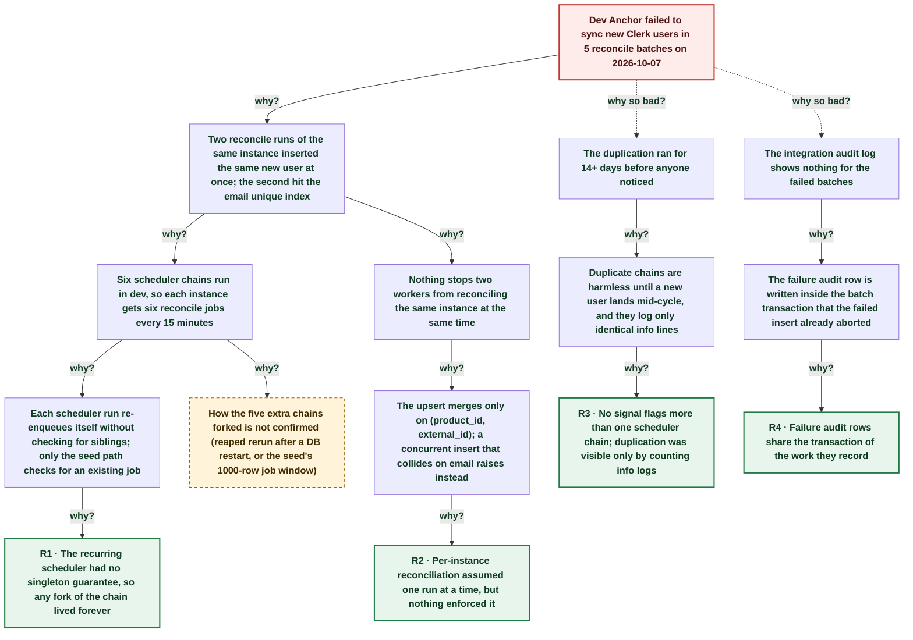

# Dev Clerk user sync failed: six reconcile scheduler chains raced on the same new user

| | |
|---|---|
| **Date** | 2026-10-07 |
| **Severity** | SEV4 |
| **Status** | In review |
| **Service** | anchor |
| **Authors** | Nanostack routine (posthog-error-watch) |
| **Duration** | 15m 04s (trigger to resolution) |
| **Time to detect** | 16h 58m |
| **Time to mitigate** | 1s |

> Blameless: this document names systems, processes and missing guards, not people.

## Summary

On 2026-10-07 between 18:10Z and 18:25Z the dev Anchor logged 5 failed Clerk user upserts (`23505 product_users_product_id_email_key`). Dev runs **six** copies of the self-rescheduling reconcile scheduler job, so every 15 minutes it reconciles each keyed Clerk instance six times in parallel across two replicas. When a new Clerk user appeared, two runs inserted it at once and the loser hit the email unique index, which the upsert's `ON CONFLICT (product_id, external_id)` does not cover. A sibling run committed the user within a second, so no data was lost. The fix makes the scheduler collapse duplicate chains to one and serialises reconciliation per instance with an advisory lock.

## Impact

Dev only, no customer impact. Five reconcile batches rolled back and were redone by a sibling run within about 1 s. Their failure audit rows were lost. Dev has also called the Clerk list-users API six times per instance every 15 minutes since at least 2026-09-24. Prod runs one chain and was not affected, but runs the same unguarded code.

- **5** failed reconcile batches (dev)
- **6x** reconciles per instance per cycle in dev
- **14+ days** duplication went unnoticed
- **0** prod errors

## Trigger

A new Clerk user was listed by two concurrent reconcile runs of the same instance; both inserted it, and the second insert hit `product_users_product_id_email_key`.

## Detection

The daily PostHog error-watch routine found the 5 error rows the next morning. No alert fires on dev error logs from background jobs, and nothing counts scheduler chains; the duplication had been visible only as 6 identical info lines per cycle.

## Resolution

Each failing batch was redone by a sibling run that found the user already present. The permanent fix (anchor PR) removes duplicate pending scheduler jobs on every scheduler run, keeping the lowest id, and takes a per-instance advisory lock around reconciliation.

## Timeline (UTC)

| Time | | Event |
|---|---|---|
| ~12:00 | T−13d 06h | **Dev already runs 6 scheduler chains (earliest logs)** `reconcile scheduler completed` counts 288 per 12 h in dev (6 per 15-min cycle) from the start of log retention; prod counts 1 per cycle. |
| 18:10:38 | T−1s | **Six scheduler runs in 84 ms each enqueue the same instance** Tasks `qnu5ok` and `q5tw87` then reconcile the instance concurrently. |
| 18:10:38 | T+0s | **First upsert fails: 23505 on product_id+email** `failed to upsert product user` for a new Clerk user; the batch rolls back and its failure audit row fails with `25P02`. |
| 18:10:39 | T+1s | **A sibling run commits the same user** |
| 18:25:40 | T+15m 02s | **Next cycle: one more new user fails on both replicas** |
| 18:25:42 | T+15m 04s | **All batches committed; no further upsert errors** |
| 11:08:53 | T+16h 58m | **Daily PostHog error watch finds the 5 rows** |
| ~11:40 | T+17h 29m | **Fix opened: scheduler dedupe + per-instance lock** |

## Root cause analysis: the five whys

Start at the impact and ask why until the answer is something the team can change. Solid edges ask why it happened; dashed edges ask why the impact was as large as it was.

- **Problem:** Dev Anchor failed to sync new Clerk users in 5 reconcile batches on 2026-10-07
  - **Why?** Two reconcile runs of the same instance inserted the same new user at once; the second hit the email unique index _Evidence: dev logs 18:10:38-39Z: `failed to upsert product user` on task `qnu5ok` while task `q5tw87` commits batches for the same instance; the user is created at 18:10:39.181_
    - **Why?** Six scheduler chains run in dev, so each instance gets six reconcile jobs every 15 minutes _Evidence: 6 `reconcile scheduler completed` per cycle in dev (288 per 12 h since 2026-09-24), 1 per cycle in prod_
      - **Why?** Each scheduler run re-enqueues itself without checking for siblings; only the seed path checks for an existing job _Evidence: `runReconcileScheduler` calls `enqueueReconcileSchedulerJob` unconditionally; `hasSchedulerJob` runs only in the seed and start paths_
        - **Why?** The recurring scheduler had no singleton guarantee, so any fork of the chain lived forever → **Root cause R1** (fixed by A1, A5)
      - **Why?** How the five extra chains forked is not confirmed (reaped rerun after a DB restart, or the seed's 1000-row job window) → _open, still investigating_
    - **Why?** Nothing stops two workers from reconciling the same instance at the same time _Evidence: `runInstanceReconcile` takes no lock; the 2-minute visibility timeout also re-runs a slow reconcile while it is still running_
      - **Why?** The upsert merges only on (product_id, external_id); a concurrent insert that collides on email raises instead _Evidence: `UpsertByExternalID` uses `ON_CONFLICT(ProductID, ExternalID)`; error is `23505 product_users_product_id_email_key`_
        - **Why?** Per-instance reconciliation assumed one run at a time, but nothing enforced it → **Root cause R2** (fixed by A2, A5)
  - **Why so bad?** The duplication ran for 14+ days before anyone noticed _Evidence: scheduler counts flat at 6 per cycle since 2026-09-24; first upsert error in 30 days on 2026-10-07_
    - **Why?** Duplicate chains are harmless until a new user lands mid-cycle, and they log only identical info lines
      - **Why?** No signal flags more than one scheduler chain; duplication was visible only by counting info logs → **Root cause R3** (fixed by A3)
  - **Why so bad?** The integration audit log shows nothing for the failed batches _Evidence: every failure is paired with `failed to create integration audit log ... (25P02)`_
    - **Why?** The failure audit row is written inside the batch transaction that the failed insert already aborted
      - **Why?** Failure audit rows share the transaction of the work they record → **Root cause R4** (fixed by A4)

## Root causes

- **R1** The recurring scheduler had no singleton guarantee, so any fork of the chain lived forever
- **R2** Per-instance reconciliation assumed one run at a time, but nothing enforced it
- **R3** No signal flags more than one scheduler chain; duplication was visible only by counting info logs
- **R4** Failure audit rows share the transaction of the work they record

## Contributing factors

- Dev flow suites create and delete Clerk users every few minutes, so new users often appear mid-cycle in dev and rarely in prod.
- The integration queue's 2-minute visibility timeout can re-run a slow reconcile while the first run is still working.

## Lessons learned

### What went well

- The daily log scan caught a dev-only error the alerts ignore, and the 6x duplication behind it.
- Sibling runs repaired each failed batch within a second, so no user stayed unsynced.

### What went wrong

- A self-rescheduling queue job had liveness but no uniqueness; nobody checked how many chains existed.
- Failure audit rows vanished silently, so the integration audit log could not show the failures.

### Where we got lucky

- Prod runs a single chain. One fork in prod would have caused the same failures for customer Clerk instances.
- Every collision was an insert of the same user; a run that updated a user with stale data while another inserted could have overwritten fresher fields.

## Action items

| ID | Action | Type | Owner | Due | Status | Ticket | Fixes |
|---|---|---|---|---|---|---|---|
| A1 | Scheduler run removes duplicate pending scheduler jobs, keeping the lowest id; CT proves duplicates collapse to one | prevent | anchor | 2026-10-10 | open | [anchor fix PR](https://github.com/nanostack-dev/anchor/pulls) | R1 |
| A2 | Per-instance advisory lock around reconciliation; a second run skips | prevent | anchor | 2026-10-10 | open | [anchor fix PR](https://github.com/nanostack-dev/anchor/pulls) | R2 |
| A3 | Log `removed duplicate reconcile scheduler jobs` at warn so any new fork shows in the warn-spike alert | detect | anchor | 2026-10-10 | open | [anchor#211](https://github.com/nanostack-dev/anchor/pull/211) | R3 |
| A4 | Persist failure audit rows outside the aborted batch transaction | mitigate | anchor | 2026-10-24 | open | [anchor#210](https://github.com/nanostack-dev/anchor/issues/210) | R4 |
| A5 | Guide line in anchor AGENTS.md: recurring queue jobs dedupe themselves and per-resource jobs take an advisory lock | process | anchor | 2026-10-10 | open | [anchor#211](https://github.com/nanostack-dev/anchor/pull/211) | R1, R2 |

## Responders

- **Investigation**: Nanostack routine (posthog-error-watch)

## Messaging

### Internal

Dev Anchor: 5 Clerk user upserts failed on 10-07 because dev runs 6 copies of the reconcile scheduler and two raced on a new user. No data loss, prod unaffected (1 chain). Fix PR collapses duplicate chains and locks reconcile per instance; awaiting review.

### Customers

None: dev only.

## Supporting information

- [Postmortem report](https://claude.ai/artifact/J26PXvbhmHEuTjcqF5tBZV)
- [Follow-up: lost failure audit rows (anchor#210)](https://github.com/nanostack-dev/anchor/issues/210)
