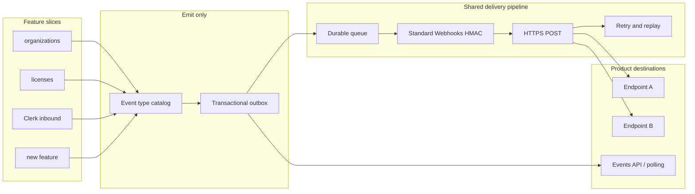

# Outbound HTTP webhooks for Anchor (2026)

Research date: 2026-08-31.

Scope: envelope format, HTTP delivery/signing/retry, event-type registration, headers and failure handling. Compared against primary specs and first-party docs only. If a source is silent, this document says so.

Anchor context (this repo, not a webhook spec):

- Anchor is Organization-as-a-Service: hierarchy, identity, RBAC, tenancy, licensing.
- Products built on Anchor need domain events.
- Clerk is an inbound integration today (`POST /v1/products/{product_id}/integrations/webhooks/{provider_type}`).
- Durable background work in this workspace is supposed to use `pgkit/pgqueue` or DB-backed state, not a bare `go func()`.

---

## Executive recommendation (what Anchor should copy)

Copy **three layers**, not one format:

| Layer | Copy | Do not make this the default |
| --- | --- | --- |
| Envelope (JSON body) | Stripe / Clerk / WorkOS object envelope + Standard Webhooks payload fields (`type`, `timestamp`, `data`) | CloudEvents as the customer-facing default |
| Delivery (HTTP) | Standard Webhooks signing + retries (Svix implements this; Clerk uses Svix) | GitHub HMAC-of-body-only; Auth0 bearer-token webhooks |
| Registration | Svix event-type catalog: name + schema + filter, independent of the dispatcher | Hard-coding types inside the HTTP sender |

### Copy this, in order

1. **Transactional outbox on the write path.** Persist the domain change and the outbound event in the same database transaction. A separate worker delivers. This is the Transactional Outbox pattern ([Chris Richardson](https://microservices.io/patterns/data/transactional-outbox.html); [Microsoft Azure Architecture Center](https://learn.microsoft.com/en-us/azure/architecture/databases/guide/transactional-out-box-cosmos)). Without it, a crash after commit and before HTTP POST loses the event.

2. **One shared dispatcher.** Features only insert `(event_type, payload, tenant_ids)`. They do not open HTTP, sign, retry, or SSRF-filter. Svix's model is one API call per message; Svix fans out to endpoints ([Svix Quickstart](https://docs.svix.com/quickstart)). Clerk already outsources sending to Svix ([Clerk webhooks overview](https://clerk.com/docs/guides/development/webhooks/overview)).

3. **Standard Webhooks v1.0.0 for the wire.** Headers `webhook-id`, `webhook-timestamp`, `webhook-signature`. Signed content is `msg_id.timestamp.payload`. Symmetric scheme: HMAC-SHA256, secret `whsec_` + base64, signature identifier `v1`. Replay window: consumers reject timestamps outside a tolerance (spec: "some allowable tolerance"; Svix/Stripe libraries default to 5 minutes). Spec: [standard-webhooks.md](https://github.com/standard-webhooks/standard-webhooks/blob/main/spec/standard-webhooks.md). Svix co-created it and implements it, with `svix-*` as branded aliases of the same headers ([Svix FAQ](https://docs.svix.com/faq), [Svix verify](https://docs.svix.com/receiving/verifying-payloads/how)).

4. **Stripe/Clerk-style JSON envelope inside that signed body.** Top-level `id` (or reuse `webhook-id`), `type` as `resource.action` (`organization.created`), `timestamp` (ISO-8601 in Standard Webhooks; Clerk uses milliseconds; Stripe snapshot uses Unix seconds), `data` as the resource (full snapshot for v1). Clerk's documented fields: `data`, `object: "event"`, `type`, `timestamp`, `instance_id` ([Clerk payload](https://clerk.com/docs/guides/development/webhooks/overview)). WorkOS: `event`, `id`, `data`, `created_at`, optional `context` ([WorkOS Events](https://workos.com/docs/events)). Standard Webhooks recommends `type`, `timestamp`, `data` and does not require CloudEvents fields.

5. **Event types as a catalog, not as code in the sender.** Hierarchical names `[a-zA-Z0-9_.]+` / period-delimited groups. JSON Schema (Svix: Draft 7) per type. Consumers subscribe per endpoint. Import from OpenAPI `webhooks` / `x-webhooks`. Feature flags hide beta types from the catalog without changing deliverability ([Svix Event Types](https://docs.svix.com/event-types)). Stripe uses `resource.event` and a public catalog ([Stripe event types](https://docs.stripe.com/api/events/types)).

6. **At-least-once + consumer idempotency.** Delivery is at-least-once (Svix, Stripe, Hook0, WorkOS, Auth0 all say this). The stable message id (`webhook-id` / Stripe `evt_…` / WorkOS `event_…`) is the idempotency key. Do not promise exactly-once. Hook0 states exactly-once is not possible; use effectively-once via dedup ([Hook0 delivery guarantees](https://documentation.hook0.com/explanation/webhook-delivery-guarantees)).

7. **Add an Events API (pull) next to push.** WorkOS recommends the Events API over webhooks for user and directory sync: ordered, replayable, no public endpoint ([WorkOS API vs webhooks](https://workos.com/docs/events/data-syncing)). Auth0 also ships an SSE Events API as a pull alternative ([Auth0 Events](https://auth0.com/docs/customize/events)). Svix offers polling endpoints as an advanced destination ([Svix polling endpoints](https://docs.svix.com/advanced-endpoints/polling-endpoints)). For OaaS (memberships, licenses), products will miss pushes; they need a cursor they can replay.

8. **Start with full snapshots, document thin as a later option.** Standard Webhooks describes thin vs full; Stripe now ships both snapshot and thin events ([Stripe event destinations](https://docs.stripe.com/event-destinations)). Full snapshots match Clerk and WorkOS identity objects and avoid a fetch on every event. Stripe's reason for thin is versioning and freshness, not a replacement of HMAC delivery.

### Dispatcher choice (implementation, not envelope)

| Option | What the owner documents | Fit for Anchor |
| --- | --- | --- |
| Svix hosted | One `message.create`; retries, signatures, portal, catalog ([Quickstart](https://docs.svix.com/quickstart)) | Fastest path; Clerk already uses it |
| Svix OSS (`svix-webhooks`) | MIT, Rust server, Postgres + optional Redis, Standard Webhooks, SSRF block by default ([GitHub README](https://github.com/svix/svix-webhooks)) | Self-host if you must keep events in your VPC |
| Convoy | HMAC simple or Stripe-like advanced signatures; linear or exponential retry; endpoint states ([Convoy signatures](https://getconvoy.io/docs/product-manual/signatures), [retries](https://www.getconvoy.io/webhook-guides/webhook-retries)) | Alternative OSS gateway; signature is not Standard Webhooks by default |
| Hook0 | Event types as API resource; HMAC `X-Hook0-Signature`; fixed retry schedule ([Hook0 retry](https://documentation.hook0.com/explanation/webhook-retry-logic)) | Smaller OSS; signature is not Standard Webhooks |
| Hand-roll on `pgkit/pgqueue` | Workspace rule: durable work uses pgqueue | Only if you reimplement Standard Webhooks + SSRF + retry + portal; do not invent a new signature |

**Recommendation:** emit from the outbox into Svix (hosted or OSS). Do not build a second HMAC scheme. If Svix is deferred, implement Standard Webhooks on pgqueue and keep the same headers so you can swap the dispatcher later.

### Why not CloudEvents as the default body

CloudEvents 1.0.2 is a CNCF Graduated spec for **describing** events (`id`, `source`, `specversion`, `type`, `time`, optional `data`) ([spec](https://github.com/cloudevents/spec/blob/v1.0.2/cloudevents/spec.md), [cloudevents.io](https://cloudevents.io/)). The HTTP binding defines binary (`ce-*` headers) and structured (`application/cloudevents+json`) modes ([HTTP binding](https://github.com/cloudevents/spec/blob/v1.0.2/cloudevents/bindings/http-protocol-binding.md)).

That spec is **silent** on: HMAC signatures, `webhook-id`, retries, 2xx vs 3xx, SSRF, endpoint secrets, consumer portals.

Auth0 Event Streams "conform to the CloudEvent specification" for the object schema ([Auth0 Events Catalog](https://auth0.com/docs/customize/events)). Their webhook destination authenticates with a **bearer token**, not Standard Webhooks HMAC ([Create an Event Stream](https://auth0.com/docs/customize/events/create-an-event-stream)). Stripe, Clerk, WorkOS, and GitHub do not document CloudEvents as their webhook envelope.

Standard Webhooks lists CloudEvents under "Related efforts" as **compatible / complementary**, not as a competing signature scheme ([README](https://github.com/standard-webhooks/standard-webhooks/blob/main/README.md)).

Use CloudEvents later as an optional structured content type (for EventBridge/Knative) **on top of** Standard Webhooks headers. Do not replace `webhook-signature`.

---

## Envelope comparison table

Columns are taken from each owner's spec or docs. "Silent" means that document does not define the field.

| | CloudEvents 1.0.2 | Standard Webhooks 1.0.0 | Stripe snapshot Event | Stripe thin Event | GitHub | Clerk | Auth0 Event Streams | WorkOS | Svix message |
| --- | --- | --- | --- | --- | --- | --- | --- | --- | --- |
| Spec owner | CNCF / cloudevents | standard-webhooks | Stripe | Stripe | GitHub | Clerk (Svix) | Auth0 | WorkOS | Svix |
| What it standardizes | Event metadata + data | Payload *conventions* + HTTP signing/ops | Product Event object | Lightweight notification | Per-event JSON + headers | Product event JSON | CloudEvents-shaped object | Product event JSON | `eventType` + opaque payload |
| Event type field | `type` (SHOULD reverse-DNS, e.g. `com.github.pull_request.opened`) | `type` (full-stop, e.g. `user.created`) | `type` (`invoice.created`) | `type` (`v2.core.account.updated`) | Header `X-GitHub-Event` + body `action` | `type` (`user.created`) | `type` (`user.created` / docs also show `com.auth0.user.<event-type>`) | `event` (`dsync.user.updated`) | API `eventType`; payload type is yours |
| Occurrence id | `id` + `source` unique together | `webhook-id` header (body id optional) | `id` (`evt_…`) | `id` (`evt_…`) | `X-GitHub-Delivery` GUID | Silent in the JSON example (Svix `svix-id` on the wire) | `id` (`evt_…`) | `id` (`event_…`) | `eventId` optional; delivery uses `webhook-id` |
| Time | `time` RFC 3339 (optional in spec; Auth0 marks required) | `timestamp` ISO 8601 in body; Unix seconds in `webhook-timestamp` | `created` Unix seconds | `created` RFC 3339 | Silent as a single event timestamp | `timestamp` milliseconds | `time` RFC 3339 | `created_at` RFC 3339 | Not required in payload |
| Data wrapper | `data` (optional) | `data` recommended, or squashed at top level | `data.object` (+ `previous_attributes` on updates) | `related_object` + fetch | Resource at top level (`issue`, `repository`, …) | `data` = API object | `data.object` | `data` = API object | `payload` JSON dict |
| Envelope marker | `specversion: "1.0"` | None required | `object: "event"` | `object: "v2.core.event"` | None | `object: "event"` | `specversion` | often `object: "event"` | None required |
| Tenant / instance | `source` URI-reference | Silent | `account` / `context` | `context` | `organization`, `installation`, … | `instance_id` | `source` URN of tenant | `data.organization_id` / `context` | Application (customer) isolation |
| Schema pointer | `dataschema` URI | Recommend JSON Schema / OpenAPI | `api_version` on the Event | Unversioned thin events | Per-event docs | Silent | `dataschema` (catalog table) | Silent | Event type JSON Schema Draft 7 |
| Thin vs full | Silent (size: keep compact, 64 KiB intermediary) | Explicit thin vs full | Snapshot = full; thin is separate product | Thin by design | Full resource graphs; 25 MB cap | Full User/Org objects | Full `data.object` | Mix: full objects, some id-only (e.g. `group.member_added`) | You choose the payload |
| Signing in this spec | Silent | HMAC-SHA256 or ed25519 | Stripe-Signature (separate doc) | Same Stripe-Signature | X-Hub-Signature-256 | Svix / Standard Webhooks | Bearer token on stream dest | WorkOS-Signature (Stripe-like) | Standard Webhooks |

Sources: [CloudEvents spec](https://github.com/cloudevents/spec/blob/v1.0.2/cloudevents/spec.md), [Standard Webhooks spec](https://github.com/standard-webhooks/standard-webhooks/blob/main/spec/standard-webhooks.md), [Stripe Event object](https://docs.stripe.com/api/events/object), [Stripe event destinations](https://docs.stripe.com/event-destinations), [GitHub events and payloads](https://docs.github.com/en/webhooks/webhook-events-and-payloads), [Clerk overview](https://clerk.com/docs/guides/development/webhooks/overview), [Auth0 Events Catalog](https://auth0.com/docs/customize/events), [WorkOS Events](https://workos.com/docs/events), [Svix Event Types](https://docs.svix.com/event-types), [Svix Quickstart](https://docs.svix.com/quickstart).

### Envelope notes the table cannot hold

- **Standard Webhooks does not mandate JSON keys.** Payload structure is a recommendation. Compatibility is defined by headers + signature, not by `specversion`.
- **GitHub is a different family.** Type lives in a header. Body is the resource plus `action`, `sender`, `repository`. That is not `{type, data}`.
- **Auth0 docs disagree with themselves on `type`.** The catalog table shows `com.auth0.user.<event-type>` and `specversion`. The create-stream handler and sync guide switch on `user.created`. The Japanese event-types page also shows a `v1beta1` example with `"type": "user.created"`. Treat Auth0 as CloudEvents-shaped, not as a stable `type` string to copy.
- **Stripe snapshot `data` is versioned** by the account API version at event creation time and does not change later ([Stripe webhooks — API versioning](https://docs.stripe.com/webhooks)). Thin events are unversioned.

---

## Delivery / signing comparison table

| | Standard Webhooks | Svix (hosted + OSS) | Stripe | GitHub | WorkOS | Auth0 Event Stream webhook | Convoy | Hook0 |
| --- | --- | --- | --- | --- | --- | --- | --- | --- |
| Method | HTTP POST, body = payload | POST | POST HTTPS | POST | POST HTTPS | POST | POST | POST |
| Signature alg | HMAC-SHA256 (`v1`) or ed25519 (`v1a`) | Same; HMAC default; ed25519 optional | HMAC-SHA256 `v1` | HMAC-SHA256; SHA-1 legacy | HMAC-SHA256 `v1` | Silent (bearer token) | HMAC; hash/encoding configurable | HMAC-SHA256 |
| Signed content | `{id}.{timestamp}.{raw body}` | Same | `{t}.{raw body}` | raw body only | `{issued_timestamp}.{raw body}` | N/A | Project-defined | `timestamp + "." + header_names + "." + header_values + "." + payload` (v1) |
| Headers | `webhook-id`, `webhook-timestamp`, `webhook-signature` | `svix-*` aliases; libraries accept both | `Stripe-Signature: t=,v1=` | `X-Hub-Signature-256`, `X-GitHub-Event`, `X-GitHub-Delivery`, `X-GitHub-Hook-ID` | `WorkOS-Signature: t=,v1=` (`t` in **milliseconds**) | `Authorization: Bearer` | `X-Convoy-Signature` | `X-Hook0-Signature` |
| Secret format | `whsec_` + base64 (24–64 bytes) | `whsec_` | `whsec_` | random high-entropy string | dashboard secret | caller-chosen token | per-endpoint secret | subscription secret |
| Timestamp in signature | Yes (seconds) | Yes | Yes (seconds) | **No** | Yes (ms) | No | Advanced mode: Stripe-like `t=,v1=` | Yes (`t=`) |
| Replay defense | Reject old/future timestamp; store `webhook-id` | Same; default 5 min in libs | Default 5 min in libs | Use `X-GitHub-Delivery` uniqueness (docs); no signed timestamp | Tolerance 3–5 min in SDKs | Silent | Advanced signatures include timestamp | Timestamp in v1 signature |
| Success | HTTP 2xx | 2xx within ~15s | 2xx quickly | 2xx within 10s | 200 OK | 2xx (docs show 204) | 2xx | 2xx; docs also say 200 within 5s for consumers |
| Redirects 3xx | Failure; do not follow | Failure | Failure | Silent in the pages cited | Silent | Silent | Silent in the pages cited | Silent |
| `410 Gone` | Disable endpoint | (inherits spec) | Silent | Silent | Silent | Silent | Silent | Silent |
| `429` / `502`/`504` | Throttle | (inherits spec) | Retry as failure | Failure | Retry | 4xx = no retry | Configurable | Retry on non-2xx |
| Auto retry | Example schedule spanning multiple days, exponential + jitter | Immediately, 5s, 5m, 30m, 2h, 5h, 10h, 10h | Live: up to **3 days** exponential; sandbox: 3 tries | **No automatic redelivery** | Up to **6 times**, exponential, **3 days** prod | **4 attempts** (1 + 3) at 1s, 2s, 4s; 4xx not retried | Linear or exponential; configurable limit | 3s, 10s, 3m, 30m, 1h, 3h, 5h, then 10h; default 24 tries / 8 days |
| Manual retry / replay | Recommended | Portal + API recover/replay | Dashboard 15 days; CLI 30 days | Manual, last **3 days** | Dashboard test/resend; Events API for reconcile | Deliveries + batch redelivery APIs | Bulk retry | Replay event API |
| Disable bad endpoints | Recommended after long failure | 5 days of all-fail → disable + operational webhook | Silent in the pages cited | N/A (no auto retry) | Silent | Auto-disable after 500 consecutive failures, 5000 total, or 3 consecutive (ticket to raise) | Inactive after consecutive failures | Silent |
| Timeout (producer) | 15–30s recommended | 15s | Silent (consumer must return 2xx fast) | 10s | Silent (return 200 immediately) | Silent | `http_timeout` on endpoint | 15s total, 5s connect |
| HTTPS | Recommended / content-dependent | Supported | Required live; TLS 1.2+ | Recommended; SSL verify on | HTTPS in examples | HTTPS endpoint | Enforce SSL option | TLS |
| SSRF | Proxy + private subnet; cites OWASP API7:2023 | Internal IPs blocked; `whitelist_subnets` | Stripe Smokescreen linked from SW spec | Silent | Silent | Silent | IP blacklist / SSRF guide | Blocks non-global IPs; DNS pinning |
| Static source IPs | Recommended to publish | [webhook-ips.json](https://docs.svix.com/webhook-ips.json) | [docs.stripe.com/ips](https://docs.stripe.com/ips) | `GET /meta` | Fixed list in docs | Silent | Published per region | Silent in retry page |
| Ordering | Silent | At-least-once; id stable across retries | **Not guaranteed** | Silent | **Not guaranteed** for webhooks; Events API is ordered | **Not guaranteed** | Silent | Silent |
| Fan-out | Multiple endpoints recommended | Application → many endpoints | Up to 16 destinations / account | Multiple hooks | Multiple endpoints | Event stream subscriptions | Subscriptions | Subscriptions |

Sources: [Standard Webhooks spec](https://github.com/standard-webhooks/standard-webhooks/blob/main/spec/standard-webhooks.md), [Svix retries](https://docs.svix.com/retries), [Svix security](https://docs.svix.com/security), [Svix OSS README](https://github.com/svix/svix-webhooks), [Stripe webhooks](https://docs.stripe.com/webhooks), [GitHub validating deliveries](https://docs.github.com/en/webhooks/using-webhooks/validating-webhook-deliveries), [GitHub best practices](https://docs.github.com/en/webhooks/using-webhooks/best-practices-for-using-webhooks), [GitHub redeliver](https://docs.github.com/en/webhooks/testing-and-troubleshooting-webhooks/redelivering-webhooks), [WorkOS webhooks](https://workos.com/docs/events/data-syncing/webhooks), [Auth0 best practices](https://auth0.com/docs/customize/events/events-best-practices), [Convoy retries](https://www.getconvoy.io/webhook-guides/webhook-retries), [Hook0 retry](https://documentation.hook0.com/explanation/webhook-retry-logic), [Hook0 security model](https://documentation.hook0.com/explanation/security-model/).

### Signature constructions (verbatim from owners)

Standard Webhooks signed content:

```text
msg_2KWPBgLlAfxdpx2AI54pPJ85f4W.1674087231.{"type":"contact.created",...}
```

Header example from the spec:

```http
webhook-id: msg_2KWPBgLlAfxdpx2AI54pPJ85f4W
webhook-timestamp: 1674087231
webhook-signature: v1,K5oZfzN95Z9UVu1EsfQmfVNQhnkZ2pj9o9NDN/H/pI4= v1a,hnO3f9T8Ytu9HwrXslvumlUpqtNVqkhqw/enGzPCXe5BdqzCInXqYXFymVJaA7AZdpXwVLPo3mNl8EM+m7TBAg==
```

Stripe `Stripe-Signature` (docs show newlines for clarity; real header is one line):

```http
Stripe-Signature: t=1492774577,v1=5257a869e7ecebeda32affa62cdca3fa51cad7e77a0e56ff536d0ce8e108d8bd,v0=6ffbb59b2300aae63f272406069a9788598b792a944a07aba816edb039989a39
```

GitHub:

```http
X-Hub-Signature-256: sha256=757107ea0eb2509fc211221cce984b8a37570b6d7586c22c46f4379c8b043e17
```

(test vector: secret `It's a Secret to Everybody`, payload `Hello, World!`)

WorkOS: parse `t=` (ms) and `v1=` from `WorkOS-Signature`; HMAC-SHA256 hex of `issued_timestamp + "." + body`.

---

## Feature-registration pattern (how to add a new event type)

Goal: a new Anchor feature (licenses, memberships, Clerk inbound, …) adds a type **without forking** signing, retries, or SSRF.

### Pattern all mature senders share

1. **Name the type** with a stable, hierarchical string.
2. **Document a sample payload + schema.**
3. **Register the type in a catalog** the consumer UI and API read.
4. **Filter at send time** so endpoints only get subscribed types.
5. **Send through one dispatcher** (`eventType` + JSON). The dispatcher does not parse domain fields.

### Stripe

- Catalog: public list, `resource.event` (`customer.subscription.updated`). Subresource events do **not** also fire the parent (`customer.updated`) ([event types](https://docs.stripe.com/api/events/types)).
- Destination subscribes via `enabled_events` ([webhooks](https://docs.stripe.com/webhooks)).
- Some types are **Selection required**: they are not generated unless a destination explicitly listens (a destination set to "all events" does not count).
- Snapshot vs thin are **separate destination registrations**.
- Versioning is on the Event object (`api_version`), not by adding `v2` into every type string (thin types use `v1.` / `v2.` prefixes for API family).
- Adding a type is: define object, add catalog entry, allow destinations to subscribe. Delivery code is unchanged.

### Clerk

- Types: `user.created`, `organization.created`, `organizationMembership.created`, `session.created`, … ([legacy list](https://clerk.com/docs/core-1/integrations/webhooks/overview); current docs point at Dashboard **Event Catalog**).
- Payload `data` is the existing API object (User, Organization, …). New types reuse objects.
- Delivery is Svix: new Clerk event = new Svix `eventType`. No new HMAC.

### WorkOS

- Types: `event` string (`organization.created`, `dsync.user.updated`, `authentication.sso_succeeded`, …) ([Events](https://workos.com/docs/events)).
- `data` matches the REST object; secrets (`code`, invitation `token`) omitted.
- Same event object for webhooks **and** the Events API. New types appear on both channels.
- Updates may include `previous_attributes`.

### Auth0

- Subscribe per stream: `user.created`, `user.updated`, `user.deleted`, `organization.created`, … ([Create Event Stream](https://auth0.com/docs/customize/events/create-an-event-stream), [sync guide](https://auth0.com/docs/customize/events/sync-data-across-systems)).
- Destinations: webhook (bearer), AWS EventBridge, Auth0 Actions. The type list is independent of destination.
- Also pull via Events API / SSE.

### GitHub

- Each event is a docs page + `X-GitHub-Event` name. Many events have `action` enums (`opened`, `closed`).
- Availability is scoped (repository / organization / app). Apps need permissions per event.
- New actions can appear on existing events; consumers must ignore unknown actions ([best practices](https://docs.github.com/en/webhooks/using-webhooks/best-practices-for-using-webhooks)).
- Event type is **not** in a `{type, data}` envelope.

### Svix (the registration API to copy)

From [Event Types](https://docs.svix.com/event-types):

- Create type: `{ name: "user.signup", description: "…" }`.
- Name pattern: `^[a-zA-Z0-9\-_.]+$`. Periods group the portal UI.
- JSON Schema Draft 7; **not enforced at ingest** (bad schema still delivers; fail client-side).
- Bulk create from CSV or OpenAPI `webhooks` / `x-webhooks`.
- Extensions: `x-svix-feature-flags`, `x-svix-group-name`.
- GitHub Action to import OpenAPI in CI.
- Public catalog on svix.com or CNAME.
- Feature flags hide types from catalog/API until the consumer's portal token includes the flag. **Endpoints with no filter still receive all messages**, flags or not.

Producer send path stays:

```text
svix.message.create(appId, { eventType, eventId, payload })
```

### Hook0 / Convoy

- Hook0: Event Types are a first-class REST resource; subscriptions filter by type ([API intro](https://documentation.hook0.com/openapi/intro)).
- Convoy: events have `event_type`; subscriptions bind endpoints to types ([events and deliveries](https://www.getconvoy.io/product-manual/events-and-event-deliveries)).

### What Anchor should implement

```text
internal/feature/<plural>/  →  domain write in one txn
                            →  outbox row { type, data, org, product, workspace }
dispatcher (Svix or pgqueue) →  sign Standard Webhooks → POST

catalog table / OpenAPI webhooks:
  organization.created
  organization.updated
  organization.deleted
  membership.created
  license.updated
  integration.clerk.user.created   # inbound Clerk, re-emitted outbound if needed
```

A new feature:

1. Add a row (or OpenAPI `webhooks` entry) with name, description, JSON Schema, example.
2. Insert outbox in the same transaction as the domain write.
3. Do not touch HTTP clients.

Keep `type` in the JSON body as well as using it for routing. Svix does **not** inject `eventType` into the payload; Stripe/Clerk/WorkOS all put the type in the body so one endpoint can switch on it ([Svix Quickstart — including the event type](https://docs.svix.com/quickstart)).

---

## Concrete payload examples (from owners)

### CloudEvents 1.0.2 JSON (spec example)

Source: [CloudEvents spec — Example](https://github.com/cloudevents/spec/blob/v1.0.2/cloudevents/spec.md).

```json
{
  "specversion": "1.0",
  "type": "com.github.pull_request.opened",
  "source": "https://github.com/cloudevents/spec/pull",
  "subject": "123",
  "id": "A234-1234-1234",
  "time": "2018-04-05T17:31:00Z",
  "comexampleextension1": "value",
  "comexampleothervalue": 5,
  "datacontenttype": "text/xml",
  "data": "<much wow=\"xml\"/>"
}
```

HTTP structured mode uses `Content-Type: application/cloudevents+json` ([HTTP binding](https://github.com/cloudevents/spec/blob/v1.0.2/cloudevents/bindings/http-protocol-binding.md)). Binary mode puts `ce-specversion`, `ce-type`, `ce-id`, `ce-source` in headers and the domain payload in the body. **No signature headers in that spec.**

### Standard Webhooks (recommended body + headers)

Source: [standard-webhooks.md](https://github.com/standard-webhooks/standard-webhooks/blob/main/spec/standard-webhooks.md).

Full:

```json
{
  "type": "contact.created",
  "timestamp": "2022-11-03T20:26:10.344522Z",
  "data": {
    "id": "1f81eb52-5198-4599-803e-771906343485",
    "type": "contact",
    "fullName": "John Smith",
    "address": "800 W NASA Pkwy, Webster, TX 77598, USA",
    "phoneNumber": "(281) 332-2575",
    "birthday": "1980-04-19",
    "occupation": "Engineer, ACME"
  }
}
```

Thin:

```json
{
  "type": "contact.created",
  "timestamp": "2022-11-03T20:26:10.344522Z",
  "data": {
    "id": "1f81eb52-5198-4599-803e-771906343485"
  }
}
```

Generic example from the same spec:

```json
{
  "type": "example.event",
  "timestamp": "2022-11-03T20:26:10.344522Z",
  "data": {
    "foo": "bar",
    "fizzbuzz": 2
  }
}
```

### Stripe snapshot Event

Source: [The Event object](https://docs.stripe.com/api/events/object) / [event destinations snapshot example](https://docs.stripe.com/event-destinations).

```json
{
  "id": "evt_1NG8Du2eZvKYlo2CUI79vXWy",
  "object": "event",
  "api_version": "2019-02-19",
  "created": 1686089970,
  "data": {
    "object": {
      "id": "seti_1NG8Du2eZvKYlo2C9XMqbR0x",
      "object": "setup_intent",
      "status": "requires_confirmation",
      "usage": "off_session"
    }
  },
  "livemode": false,
  "pending_webhooks": 0,
  "request": {
    "id": null,
    "idempotency_key": null
  },
  "type": "setup_intent.created"
}
```

(Truncated `data.object` in this file; the docs include the full SetupIntent.)

### Stripe thin Event notification

Source: [event destinations — example thin payload](https://docs.stripe.com/event-destinations).

```json
{
  "id": "evt_test_65UIRNU7G1XbhCfOim416TgmEI4ASQ3jHxXt8RFwXoeVwO",
  "object": "v2.core.event",
  "type": "v2.core.account.updated",
  "livemode": false,
  "created": "2026-03-09T13:00:28.435Z",
  "context": null,
  "reason": {
    "type": "request",
    "request": {
      "id": "req_v2y9y15XqG3Futmjg",
      "idempotency_key": "ik_TgmEI3jHxXt8RFw4jS7ve2QcAReDQWBjPAkAEUm"
    }
  },
  "related_object": {
    "id": "acct_1T93Q4Pmpb34Vto6",
    "type": "v2.core.account",
    "url": "/v2/core/accounts/acct_1T93Q4Pmpb34Vto6"
  }
}
```

### Clerk `user.created`

Source: [Clerk webhooks overview](https://clerk.com/docs/guides/development/webhooks/overview).

```json
{
  "data": {
    "birthday": "",
    "created_at": 1654012591514,
    "email_addresses": [
      {
        "email_address": "example@example.org",
        "id": "idn_29w83yL7CwVlJXylYLxcslromF1",
        "linked_to": [],
        "object": "email_address",
        "verification": {
          "status": "verified",
          "strategy": "ticket"
        }
      }
    ],
    "external_accounts": [],
    "external_id": "567772",
    "first_name": "Example",
    "gender": "",
    "id": "user_29w83sxmDNGwOuEthce5gg56FcC",
    "image_url": "https://img.clerk.com/xxxxxx",
    "last_name": "Example",
    "last_sign_in_at": 1654012591514,
    "object": "user",
    "password_enabled": true,
    "phone_numbers": [],
    "primary_email_address_id": "idn_29w83yL7CwVlJXylYLxcslromF1",
    "primary_phone_number_id": null,
    "primary_web3_wallet_id": null,
    "private_metadata": {},
    "profile_image_url": "https://www.gravatar.com/avatar?d=mp",
    "public_metadata": {},
    "two_factor_enabled": false,
    "unsafe_metadata": {},
    "updated_at": 1654012591835,
    "username": null,
    "web3_wallets": []
  },
  "instance_id": "ins_123",
  "object": "event",
  "timestamp": 1654012591835,
  "type": "user.created"
}
```

Wire signing: Svix headers (`svix-id`, `svix-timestamp`, `svix-signature`) = Standard Webhooks ([Clerk](https://clerk.com/docs/guides/development/webhooks/overview), [Svix verify](https://docs.svix.com/receiving/verifying-payloads/how)).

### GitHub `issues` (example delivery)

Source: [Webhook events and payloads](https://docs.github.com/en/webhooks/webhook-events-and-payloads).

```http
POST /payload HTTP/1.1
X-GitHub-Delivery: 72d3162e-cc78-11e3-81ab-4c9367dc0958
X-Hub-Signature-256: sha256=d57c68ca6f92289e6987922ff26938930f6e66a2d161ef06abdf1859230aa23c
User-Agent: GitHub-Hookshot/044aadd
Content-Type: application/json
X-GitHub-Event: issues
X-GitHub-Hook-ID: 292430182
```

```json
{
  "action": "opened",
  "issue": {
    "url": "https://api.github.com/repos/octocat/Hello-World/issues/1347",
    "number": 1347
  },
  "repository": {
    "id": 1296269,
    "full_name": "octocat/Hello-World",
    "owner": {
      "login": "octocat",
      "id": 1
    }
  },
  "sender": {
    "login": "octocat",
    "id": 1
  }
}
```

(Docs truncate nested objects with `...`.)

### WorkOS event (docs sample)

Source: [Data syncing](https://workos.com/docs/events/data-syncing).

```json
{
  "object": "event",
  "id": "event_07FKJ843CVE8F7BXQSPFH0M53V",
  "event": "dsync.user.updated",
  "data": {
    "id": "directory_user_01E1X1B89NH8Z3SDFJR4H7RGX7",
    "directory_id": "directory_01ECAZ4NV9QMV47GW873HDCX74",
    "organization_id": "org_01EZTR6WYX1A0DSE2CYMGXQ24Y",
    "idp_id": "8931",
    "first_name": "Lela",
    "last_name": "Block",
    "name": "Lela Block",
    "email": "lela.block@example.com",
    "state": "active",
    "created_at": "2021-06-25T19:07:33.155Z",
    "updated_at": "2021-06-25T19:07:33.155Z",
    "custom_attributes": {
      "department": "Engineering",
      "job_title": "Software Engineer"
    },
    "role": { "slug": "member" }
  },
  "created_at": "2023-04-28 20:05:31.093"
}
```

### Auth0 (catalog template)

Source: [Events Catalog Overview](https://auth0.com/docs/customize/events). Docs mark this as conforming to CloudEvents. Example uses placeholders.

```json
{
  "id": "evt_<unique-id>",
  "source": "urn:auth0:<your-tenant>:users",
  "specversion": "1.0",
  "type": "com.auth0.user.<event-type>",
  "time": "2025-01-29T14:36:25.794Z",
  "dataschema": "https://<your-tenant>.auth0.com/api/v2/schemas/user.<event-type>",
  "data": {
    "object": {
      "user_id": "<user-id>",
      "email": "<email>"
    }
  }
}
```

The create-stream Node handler reads `req.body.type` as `user.created` ([Create an Event Stream](https://auth0.com/docs/customize/events/create-an-event-stream)). Do not treat Auth0 `type` as a single frozen string.

### Svix send payload (producer → Svix)

Source: [Quickstart](https://docs.svix.com/quickstart).

```json
{
  "eventType": "invoice.paid",
  "eventId": "evt_Wqb1k73rXprtTm7Qdlr38G",
  "payload": {
    "type": "invoice.paid",
    "id": "invoice_WF7WtCLFFtd8ubcTgboSFNql",
    "status": "paid",
    "attempt": 2
  }
}
```

The `payload` is what the customer receives as the HTTP body.

---

## Headers, idempotency, retry, failure — current best practice

Synthesized only from the tables above. Where owners disagree, the Standard Webhooks spec is the 2025–2026 interoperability target (adopted by OpenAI, Anthropic, Google Gemini, Kong, Svix, Supabase, Twilio, … per [README](https://github.com/standard-webhooks/standard-webhooks/blob/main/README.md)).

### Headers Anchor should send

| Header | Value | Why |
| --- | --- | --- |
| `webhook-id` | Stable per event, same on retries | Idempotency ([SW spec](https://github.com/standard-webhooks/standard-webhooks/blob/main/spec/standard-webhooks.md), [Svix idempotency](https://docs.svix.com/idempotency)) |
| `webhook-timestamp` | Unix seconds of **this attempt** | Replay window; attempt time ≠ event time |
| `webhook-signature` | `v1,<base64>` space-separated for rotation | HMAC over `id.timestamp.body` |
| `Content-Type` | `application/json` | SW recommendation |
| (optional) `webhook-*` dual-write with `svix-*` | Only if you use Svix libraries as-is | Svix branded aliases |

Do not put the secret in the URL ([GitHub](https://docs.github.com/en/webhooks/using-webhooks/best-practices-for-using-webhooks)).

Producer-side idempotency when **calling** Svix: `Idempotency-Key` on POST, remembered ~12 hours ([Svix](https://docs.svix.com/idempotency)). Separate from consumer `webhook-id`.

### Consumer contract (document this)

1. Verify signature on the **raw** body. Re-serializing JSON breaks HMAC (SW, Stripe, Svix, GitHub, Convoy, Hook0 all warn).
2. Constant-time compare.
3. Reject timestamps outside ~5 minutes (Stripe/Svix libraries; SW says "allowable tolerance" without a number).
4. Persist `webhook-id` (Svix: e.g. Redis 24h) and skip duplicates.
5. Return 2xx **before** heavy work (Stripe, WorkOS, Auth0, GitHub 10s, Svix 15s, Hook0 5s consumer guidance).
6. Ignore unknown `type` values (GitHub: new actions appear).
7. Do not assume order (Stripe, WorkOS, Auth0). Compare resource `updated_at` / event time before overwriting.

### Retry (producer)

Copy Standard Webhooks / Svix:

| Delay after previous failure | Elapsed (Svix docs) |
| --- | --- |
| Immediate | 0 |
| 5 seconds | 5s |
| 5 minutes | 5m 5s |
| 30 minutes | 35m 5s |
| 2 hours | ~2h 35m |
| 5 hours | ~7h 35m |
| 10 hours | ~17h 35m |
| +10 hours | (Svix last step) |

Standard Webhooks' longer example continues to ~75 hours. Stripe: 3 days live. WorkOS: 6 tries / 3 days. Auth0: 4 tries in seconds — **too short for OaaS sync**; do not copy.

Treat 2xx as success; 3xx as failure; 410 as unsubscribe; 429/502/504 as back off; honor `Retry-After` when present (SW spec).

After exhaustion: mark failed, notify the product owner (email / operational webhook). Svix sends `message.attempt.exhausted` and can disable the endpoint after 5 days of total failure.

Jitter: SW recommends it; Hook0 adds 10% (never negative).

### Failure handling

- At-least-once: retries duplicate. Consumers must be idempotent.
- Manual replay after outages (Clerk Replay, Svix Recover Failed / Replay Missing, Stripe Resend, GitHub Redeliver 3 days).
- Visibility: store attempt status, HTTP code, response body (Convoy, Hook0, Svix, Stripe Workbench).
- Reconciliation channel: Events API (WorkOS, Auth0) so a product can catch up without relying on the retry window.

### Outbox (so the dispatcher has something to retry)

[Transactional outbox](https://microservices.io/patterns/data/transactional-outbox.html):

- Same transaction: aggregate + outbox row.
- Relay (poll or log tail) publishes to the broker / HTTP dispatcher.
- Relay may publish twice → consumer idempotency still required.
- Microsoft documents the same pattern with Cosmos change feed + Service Bus duplicate detection on `MessageId` ([Azure](https://learn.microsoft.com/en-us/azure/architecture/databases/guide/transactional-out-box-cosmos)).

For Anchor: write `organizations` / `licenses` / integration projections and an `outbound_event` row in one txn; `pgkit/pgqueue` (or Svix `message.create`) is the relay. A bare goroutine after commit is how events vanish on restart.

---

## CloudEvents + Standard Webhooks: complementary, not competing

### What each spec claims it is

| | CloudEvents 1.0.2 | Standard Webhooks 1.0.0 |
| --- | --- | --- |
| Self-description | "a vendor-neutral specification for defining the format of event data" ([spec](https://github.com/cloudevents/spec/blob/v1.0.2/cloudevents/spec.md)) | "a set of conventions" for producers so consumers get "a secure, consistent, and interoperable interface" ([spec](https://github.com/standard-webhooks/standard-webhooks/blob/main/spec/standard-webhooks.md)) |
| Transport | HTTP, AMQP, MQTT, Kafka, … via protocol bindings | HTTP callbacks (webhooks) only |
| Security | "Protocol level security SHOULD be employed"; no HMAC scheme | HMAC-SHA256 / ed25519 over id+timestamp+body |
| Retry / 2xx / SSRF | Silent | Specified |
| Payload schema | Context attributes + opaque `data` | Recommended `type` / `timestamp` / `data`; not required |

### Do they mention each other?

- **Standard Webhooks README — Related efforts:** "This specification is compatible with the rest of them" and lists OpenAPI, AsyncAPI, **CloudEvents**, and IETF HTTP Message Signatures ([README](https://github.com/standard-webhooks/standard-webhooks/blob/main/README.md)).
- **CloudEvents spec and HTTP binding (v1.0.2):** do **not** mention Standard Webhooks, `webhook-id`, or HMAC webhook signatures. CloudEvents HTTP security section only says the binding "does not introduce any new security features for HTTP" and "applies identically to HTTP over TLS".

They overlap only on "JSON event over HTTP". They specify different layers.

### How to combine them (allowed by both texts)

1. HTTP POST to the customer URL.
2. Body = CloudEvents structured JSON (`specversion`, `id`, `source`, `type`, `time`, `data`) **or** Standard Webhooks recommended body. Both can coexist: CloudEvents `type`/`id`/`time` map cleanly onto SW `type` / message id / `timestamp`.
3. Headers = Standard Webhooks `webhook-id`, `webhook-timestamp`, `webhook-signature` over the **raw body**. CloudEvents HTTP binding *allows* extra headers; it does not forbid `webhook-*`. Binary-mode `ce-*` headers are optional if the body is already structured CloudEvents.
4. Sign the exact bytes sent. Do not canonicalize JSON between sign and send.

Auth0 is the identity vendor that put CloudEvents in the **body** and used **bearer tokens** on the destination, not Standard Webhooks. That is a valid CloudEvents adoption and a weak webhook-auth story compared with Clerk/Svix.

EEP (listed on [cloudevents.io adopters](https://cloudevents.io/)) describes itself as using CloudEvents as envelope **and** HMAC-signed webhooks — the same split, from an adopter blurb, not from the CloudEvents spec.

### Competing only if you treat CloudEvents as a complete webhook product

If you ship only `application/cloudevents+json` with no signature, no retry policy, and reverse-DNS types, you compete with Standard Webhooks on the *consumer* experience (every customer writes a custom verifier). That is not what the CloudEvents spec asks you to do; it is what you get if you stop at the envelope.

---

## What NOT to copy

| Practice | Who does it | Why not for Anchor |
| --- | --- | --- |
| HMAC of **body only**, no signed timestamp | GitHub `X-Hub-Signature-256` | Replay: a captured POST verifies forever. GitHub tells you to dedup `X-GitHub-Delivery` instead of binding time into the MAC. |
| SHA-1 `X-Hub-Signature` | GitHub, legacy | GitHub: use SHA-256. |
| **No automatic retries** | GitHub | "GitHub does not automatically redeliver failed deliveries." Identity/license events cannot wait for a human Redeliver. |
| 4 retries in a few seconds, 4xx never retried | Auth0 Event Streams | Too little for product backends; SW/Svix/Stripe span hours–days. |
| Bearer token as the **only** webhook auth | Auth0 webhook destination | Stolen URL + token replay; no payload integrity. Fine as an *extra* header (SW allows HTTP auth); not a substitute for HMAC. |
| CloudEvents as the **only** public envelope | Auth0 | Extra fields (`specversion`, reverse-DNS `type`) with no signing gain. Product engineers on Clerk/Stripe already know `{id,type,data}`. Optional later. |
| Event type **only** in a header | GitHub `X-GitHub-Event` | Body-only log stores lose the type; SW/Stripe/Clerk put `type` in JSON. |
| GitHub `action` + sibling resource keys | GitHub | Two axes (`issues` + `opened`) instead of one `issue.opened`. Works for GitHub's catalog; worse for a small OaaS catalog. |
| Following 3xx on delivery | (SW/Stripe/Svix: treat as fail) | Extra SSRF/load. |
| Putting secrets in the webhook URL | GitHub warns against this | Logs and referrers leak it. |
| IP allowlist **without** signatures | Sometimes suggested as sufficient | IPs change; GitHub says update periodically. Use as defense in depth (Clerk + Svix IPs, Stripe IPs, WorkOS list). |
| Processing synchronously in the POST | Stripe/WorkOS/Auth0/GitHub all warn | Timeouts cause retries and duplicates. |
| `==` for MAC compare | GitHub/SW | Timing attacks. |
| Re-serialize JSON before verify | Universal footgun | Document raw body; disable framework parsers on the route. |
| Promise exactly-once | Hook0: not possible | At-least-once + idempotency key. |
| Enforce JSON Schema in the dispatcher so bad events drop | Svix explicitly does **not** | Prefer deliver + typed SDKs. Validate on the producer before enqueue. |
| Feature-flag types and assume unfiltered endpoints will not get them | Svix | Flags hide catalog rows, not delivery. |
| Hand-roll `go func()` HTTP after commit | Workspace `go-backend` rule | Lost on restart; use outbox + pgqueue or Svix. |
| Unique signing secret **shared across customers** | SW: unique per endpoint | Compromise of one product must not forge events for another. |
| Trust a public key sent **in the request** | SW additional considerations | Pin keys. |
| GitHub 25 MB payloads / SW >20 kb recommendation ignored | GitHub cap; SW size note | Keep OaaS events small; link to APIs for blobs. CloudEvents: intermediaries MUST forward ≤64 KiB. |
| Stripe thin events as v1 without a fetch API | Stripe thin needs `fetchRelatedObject` | Only if Anchor exposes GET-by-id for every resource in `data`. |
| WorkOS `t` in milliseconds mixed with SW seconds | WorkOS vs SW | Pick one; SW is seconds. |
| Convoy/Hook0 custom signature as the public contract | Those products | Customers cannot use `standardwebhooks` libraries. |

---

## Suggested Anchor v1 contract (traceable to sources)

Not a new spec: a profile.

**HTTP**

- `POST` JSON, TLS 1.2+.
- Headers: `webhook-id`, `webhook-timestamp`, `webhook-signature` per [Standard Webhooks](https://github.com/standard-webhooks/standard-webhooks/blob/main/spec/standard-webhooks.md).
- Secret: `whsec_` + base64, unique per endpoint, rotatable with two `v1,` signatures.

**Body**

```json
{
  "id": "evt_…",
  "object": "event",
  "type": "organization.created",
  "timestamp": "2026-08-31T12:00:00.000Z",
  "data": {
    "object": { }
  },
  "product_id": "prod_…",
  "organization_id": "org_…"
}
```

Field roles:

- `id` / `object` / `type` / `data.object` — Stripe + Clerk.
- `timestamp` ISO-8601 — Standard Webhooks (prefer this over Clerk's milliseconds or Stripe's Unix `created` for new APIs).
- `product_id` / `organization_id` — Anchor tenancy; analogous to Clerk `instance_id` and WorkOS `organization_id`.

Set `webhook-id` equal to `id` so consumers can use either.

**Retries:** Svix schedule. **Success:** 2xx. **Idempotency:** `webhook-id`. **Catalog:** Svix/OpenAPI webhooks. **Pull API:** WorkOS-style cursor later.

**Inbound Clerk** stays on Svix verification (already in Anchor). Outbound should look the same to product developers who already verify Clerk.

---

## Sources

### Specs (owners)

- CloudEvents 1.0.2: [https://github.com/cloudevents/spec/blob/v1.0.2/cloudevents/spec.md](https://github.com/cloudevents/spec/blob/v1.0.2/cloudevents/spec.md)
- CloudEvents HTTP Protocol Binding 1.0.2: [https://github.com/cloudevents/spec/blob/v1.0.2/cloudevents/bindings/http-protocol-binding.md](https://github.com/cloudevents/spec/blob/v1.0.2/cloudevents/bindings/http-protocol-binding.md)
- CloudEvents project site (graduation 2024-01-25; spec 1.0.2 on 2022-02-05): [https://cloudevents.io/](https://cloudevents.io/)
- Standard Webhooks spec 1.0.0: [https://github.com/standard-webhooks/standard-webhooks/blob/main/spec/standard-webhooks.md](https://github.com/standard-webhooks/standard-webhooks/blob/main/spec/standard-webhooks.md)
- Standard Webhooks README (related efforts, adopters): [https://github.com/standard-webhooks/standard-webhooks/blob/main/README.md](https://github.com/standard-webhooks/standard-webhooks/blob/main/README.md)
- OpenAPI 3.1 `webhooks` field (cited by Svix): [https://github.com/OAI/OpenAPI-Specification/blob/main/versions/3.1.0.md](https://github.com/OAI/OpenAPI-Specification/blob/main/versions/3.1.0.md)
- IETF HTTP Message Signatures (listed as related by Standard Webhooks; not used as Anchor's scheme): [https://httpwg.org/http-extensions/draft-ietf-httpbis-message-signatures.html](https://httpwg.org/http-extensions/draft-ietf-httpbis-message-signatures.html)
- OWASP API7:2023 SSRF (cited by Standard Webhooks): [https://owasp.org/API-Security/editions/2023/en/0xa7-server-side-request-forgery/](https://owasp.org/API-Security/editions/2023/en/0xa7-server-side-request-forgery/)

### Stripe

- Receive events: [https://docs.stripe.com/webhooks](https://docs.stripe.com/webhooks)
- Event object: [https://docs.stripe.com/api/events/object](https://docs.stripe.com/api/events/object)
- Event types: [https://docs.stripe.com/api/events/types](https://docs.stripe.com/api/events/types)
- Event destinations (thin vs snapshot): [https://docs.stripe.com/event-destinations](https://docs.stripe.com/event-destinations)

### GitHub

- Events and payloads: [https://docs.github.com/en/webhooks/webhook-events-and-payloads](https://docs.github.com/en/webhooks/webhook-events-and-payloads)
- Validating deliveries: [https://docs.github.com/en/webhooks/using-webhooks/validating-webhook-deliveries](https://docs.github.com/en/webhooks/using-webhooks/validating-webhook-deliveries)
- Best practices: [https://docs.github.com/en/webhooks/using-webhooks/best-practices-for-using-webhooks](https://docs.github.com/en/webhooks/using-webhooks/best-practices-for-using-webhooks)
- Handling deliveries: [https://docs.github.com/en/webhooks/using-webhooks/handling-webhook-deliveries](https://docs.github.com/en/webhooks/using-webhooks/handling-webhook-deliveries)
- Redelivering: [https://docs.github.com/en/webhooks/testing-and-troubleshooting-webhooks/redelivering-webhooks](https://docs.github.com/en/webhooks/testing-and-troubleshooting-webhooks/redelivering-webhooks)

### Clerk

- Overview (Svix, payload, retry/replay): [https://clerk.com/docs/guides/development/webhooks/overview](https://clerk.com/docs/guides/development/webhooks/overview)
- Syncing: [https://clerk.com/docs/guides/development/webhooks/syncing](https://clerk.com/docs/guides/development/webhooks/syncing)
- Historical event list: [https://clerk.com/docs/core-1/integrations/webhooks/overview](https://clerk.com/docs/core-1/integrations/webhooks/overview)

### WorkOS

- Events catalog: [https://workos.com/docs/events](https://workos.com/docs/events)
- Data syncing (API vs webhooks): [https://workos.com/docs/events/data-syncing](https://workos.com/docs/events/data-syncing)
- Webhooks (signature, retry, best practices): [https://workos.com/docs/events/data-syncing/webhooks](https://workos.com/docs/events/data-syncing/webhooks)

### Auth0

- Events: [https://auth0.com/docs/customize/events](https://auth0.com/docs/customize/events)
- Catalog / CloudEvents mapping: [https://auth0.com/docs/customize/events](https://auth0.com/docs/customize/events) (Events Catalog Overview)
- Create stream (bearer webhook): [https://auth0.com/docs/customize/events/create-an-event-stream](https://auth0.com/docs/customize/events/create-an-event-stream)
- Best practices (retries, disable): [https://auth0.com/docs/customize/events/events-best-practices](https://auth0.com/docs/customize/events/events-best-practices)
- Sync data: [https://auth0.com/docs/customize/events/sync-data-across-systems](https://auth0.com/docs/customize/events/sync-data-across-systems)
- Events API (SSE): [https://auth0.com/docs/customize/events/consume-events-with-events-api](https://auth0.com/docs/customize/events/consume-events-with-events-api)

### Svix

- Quickstart: [https://docs.svix.com/quickstart](https://docs.svix.com/quickstart)
- Event types: [https://docs.svix.com/event-types](https://docs.svix.com/event-types)
- Retries: [https://docs.svix.com/retries](https://docs.svix.com/retries)
- Idempotency: [https://docs.svix.com/idempotency](https://docs.svix.com/idempotency)
- Verify: [https://docs.svix.com/receiving/verifying-payloads/how](https://docs.svix.com/receiving/verifying-payloads/how)
- Security: [https://docs.svix.com/security](https://docs.svix.com/security)
- FAQ (Standard Webhooks compliance): [https://docs.svix.com/faq](https://docs.svix.com/faq)
- OSS server: [https://github.com/svix/svix-webhooks](https://github.com/svix/svix-webhooks)

### Convoy

- Signatures: [https://getconvoy.io/docs/product-manual/signatures](https://getconvoy.io/docs/product-manual/signatures)
- Retries: [https://www.getconvoy.io/webhook-guides/webhook-retries](https://www.getconvoy.io/webhook-guides/webhook-retries)
- Events and deliveries: [https://www.getconvoy.io/product-manual/events-and-event-deliveries](https://www.getconvoy.io/product-manual/events-and-event-deliveries)
- Endpoints: [https://docs.getconvoy.io/docs/product-manual/endpoints](https://docs.getconvoy.io/docs/product-manual/endpoints)

### Hook0

- Retry logic: [https://documentation.hook0.com/explanation/webhook-retry-logic](https://documentation.hook0.com/explanation/webhook-retry-logic)
- Delivery guarantees: [https://documentation.hook0.com/explanation/webhook-delivery-guarantees](https://documentation.hook0.com/explanation/webhook-delivery-guarantees)
- Security model: [https://documentation.hook0.com/explanation/security-model/](https://documentation.hook0.com/explanation/security-model/)
- API intro: [https://documentation.hook0.com/openapi/intro](https://documentation.hook0.com/openapi/intro)
- Best practices: [https://documentation.hook0.com/how-to-guides/webhook-best-practices](https://documentation.hook0.com/how-to-guides/webhook-best-practices)

### Transactional outbox

- Chris Richardson: [https://microservices.io/patterns/data/transactional-outbox.html](https://microservices.io/patterns/data/transactional-outbox.html)
- Microsoft Azure Architecture Center: [https://learn.microsoft.com/en-us/azure/architecture/databases/guide/transactional-out-box-cosmos](https://learn.microsoft.com/en-us/azure/architecture/databases/guide/transactional-out-box-cosmos)

### Silent on purpose

The following were **not** found in the cited primary specs (do not invent them):

- CloudEvents: webhook HMAC, retry schedule, `webhook-id`, consumer idempotency headers.
- Standard Webhooks: numeric default for timestamp tolerance; CloudEvents field mapping; `specversion`.
- GitHub: automatic retry schedule.
- Clerk: CloudEvents; numeric retry table (defers to Svix).
- WorkOS: Standard Webhooks header names (uses Stripe-like `WorkOS-Signature`).
- Auth0 webhook destination: HMAC over body (uses bearer).
- Stripe: CloudEvents content type for webhooks.

---

## Appendix: recommended data flow



New features stop at the catalog + outbox. They do not implement HTTP.
