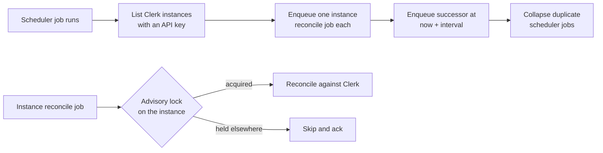
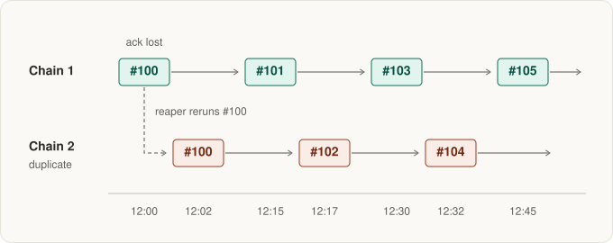
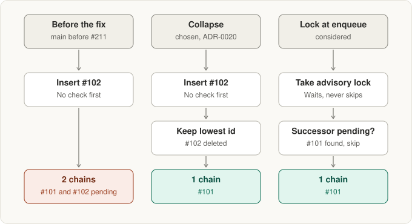

# Clerk reconcile scheduler

Clerk webhooks deliver user changes as they happen. On a fixed interval Anchor also reconciles every Clerk integration instance: it reads the instance's users from the Clerk API and applies them through the same commands a webhook produces, so product users converge even when a webhook was missed.

Both job kinds run on the pgqueue queue `integration-reconcile` ([`integration_event_worker.go`](../../apps/anchor/internal/service/integration_event_worker.go), [`integration_service.go`](../../apps/anchor/internal/service/integration_service.go)):

| Job | Payload | Does |
| --- | --- | --- |
| Scheduler | `{"is_scheduler":true}` | Enqueues one instance reconcile job per Clerk instance with an API key, then enqueues its own successor. |
| Instance reconcile | `{"integration_instance_id":"…"}` | Reads the instance's users from Clerk and applies them as webhook commands. |

## One cycle



The interval is `integration.reconcile_schedule_interval` (`INTEGRATION_RECONCILE_SCHEDULE_INTERVAL`, default `15m`). An invalid value logs a warning and falls back to the default.

## Starting and stopping the chain

The scheduler is a chain: each run inserts the next run. Nothing else drives it, so these paths create or remove it:

| When | Function | Effect |
| --- | --- | --- |
| Every replica starts | `seedReconcileScheduler` | Under the advisory lock `integration.reconcile_scheduler.seed`, inserts a scheduler job when the Clerk provider is registered, a Clerk instance has an API key, and no scheduler job is pending or processing. |
| A Clerk instance gains its first API key | `maybeStartReconcileScheduler` | Same lock and check as the startup seed. |
| The last API key is removed, or its instance deleted | `maybeCancelReconcileScheduler` | Deletes every pending scheduler job. |
| An instance is created with a key, or its key is added, rotated or removed | `enqueueReconcileJobIfRequired` | Enqueues an immediate instance reconcile job inside the write transaction. |

## Invariant: one scheduler chain

Exactly one scheduler job may be pending at a time. A second chain doubles every reconcile and every Clerk API call, and two reconciles of the same instance can insert the same new user at once ([postmortem](../postmortems/2026-10-07-duplicate-clerk-reconcile.md): dev ran six chains for 14+ days).

### How a chain forks

A run inserts its successor with a plain `Enqueue`, and the queue worker acks the run afterwards in a separate statement. When the ack is lost, for example during a database restart, the run stays `processing`. After the 2-minute visibility timeout (`integrationVisibilityTimeout`) the reaper moves it back to `pending`, it runs again, and it inserts a second successor:



The startup seed can also fork the chain: it checks `pending` and then `processing` in two queries, and a running scheduler does not take the seed lock, so a successor inserted and acked between the two queries goes unseen. The postmortem leaves open which path created the six dev chains.

### How the collapse keeps one chain

After inserting its successor, every run calls `collapseDuplicateSchedulerJobs`. It lists the pending scheduler jobs (`Search: "is_scheduler"`, at most 1000), keeps the lowest id and deletes the rest. Every replica keeps the same lowest id, so concurrent runs converge on one chain. When it deletes anything it logs `removed duplicate reconcile scheduler jobs` at warn with `scheduler_jobs_removed`.

The same rerun of `#100`, with `#101` already pending, under each design:



[ADR-0020](../adr/0020-self-rescheduling-jobs-collapse-duplicates.md) records why the collapse was chosen over the lock and over unique jobs in pgkit.

## Per-instance lock

One chain does not guarantee one reconcile per instance at a time:

- A reaped scheduler rerun enqueues every instance a second time before its successor is collapsed.
- A key change enqueues an immediate reconcile that can overlap the scheduled one.
- A reconcile slower than the visibility timeout is reaped and run again while the first run is still working.

Two concurrent runs insert the same new Clerk user. The upsert merges only on `(product_id, external_id)`, so the second insert fails on `product_users_product_id_email_key` (`23505`) and its batch rolls back. `runInstanceReconcile` therefore wraps the work in `pglock.TryWithLock` on `integration.reconcile.instance:<instance id>`. A run that does not get the lock logs `instance reconcile already running on another worker, skipping` at info and acks; the run holding the lock covers the same users.

## Known limitations

- The collapse removes a duplicate after it exists. The run that created it has already enqueued every instance once more; the per-instance lock absorbs that.
- `DeleteJob` refuses a job a worker has just claimed. That copy runs once more and the next run collapses its successor.
- `TryWithLock` holds a database transaction, and one pooled connection, open for the whole instance reconcile, including the Clerk API calls.
- A failed batch loses its failure audit row because the row is written inside the aborted transaction ([anchor#210](https://github.com/nanostack-dev/anchor/issues/210)).

## Diagnose

- Healthy: one `reconcile scheduler completed` info log per interval per environment. N logs per interval means N chains.
- A fork that the collapse removed shows as the warn `removed duplicate reconcile scheduler jobs`. Repeated warns mean something keeps forking the chain; look for lost acks or reaper activity on `integration-reconcile` around the same time.
- Inspect the queue directly:

  ```sql
  SELECT id, status, available_at, attempts
  FROM pgqueue_jobs
  WHERE queue_name = 'integration-reconcile'
    AND status IN ('pending', 'processing')
    AND encode(payload, 'escape') LIKE '%"is_scheduler":true%'
  ORDER BY id;
  ```

  Expect one `pending` row, plus one `processing` row while a run is in flight. Zero rows while a Clerk instance has an API key means the chain is gone; restarting a replica seeds it again.

## Tests

`TestSchedulerLifecycle_*` in [`integration_reconcile_lifecycle_test.go`](../../apps/anchor/cmd/it/ct/integration_reconcile_lifecycle_test.go) cover start, cancel and `DuplicateSchedulerJobs_CollapseToOne`. They run serially because they count jobs on the process-wide reconcile queue.
